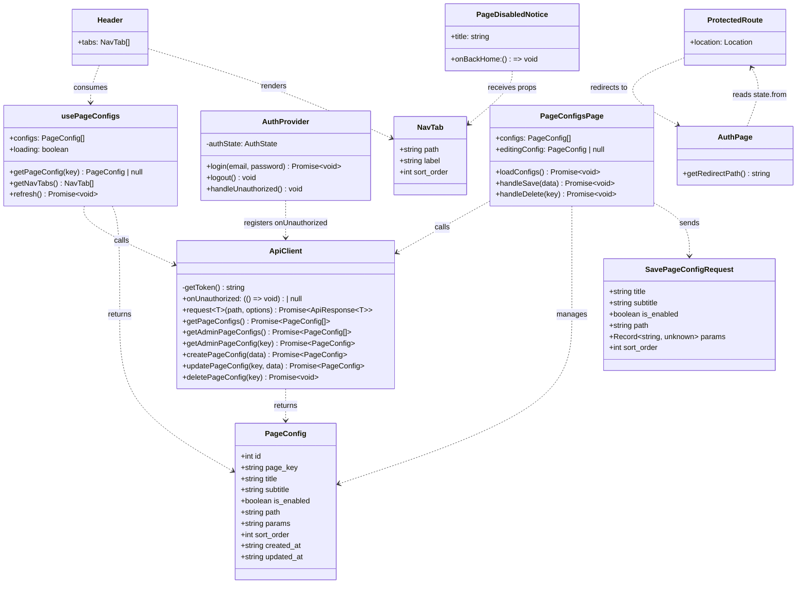
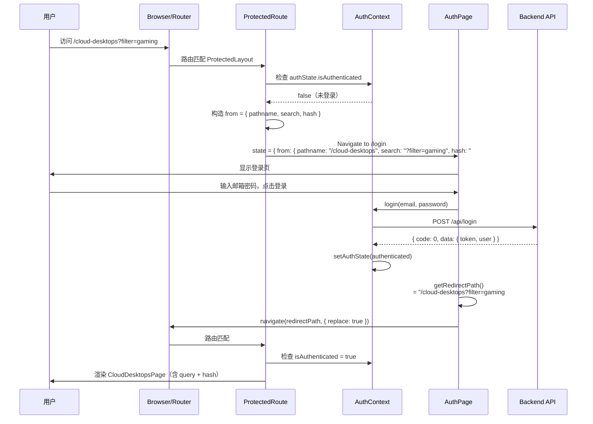
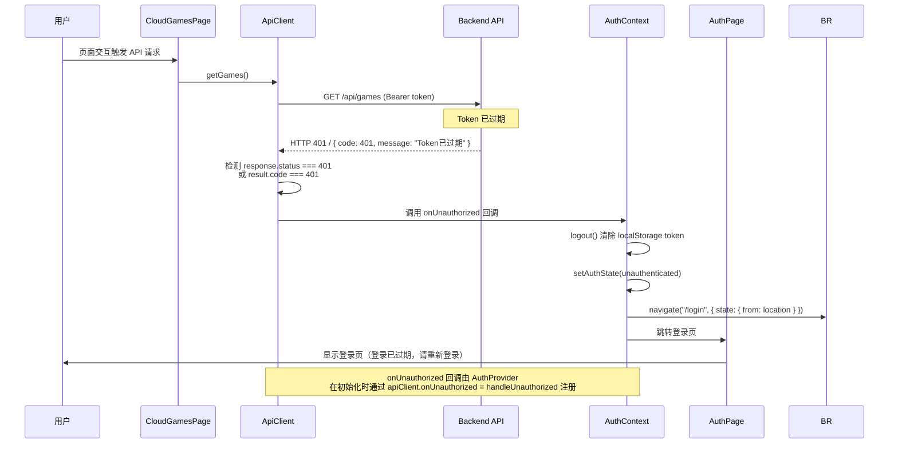
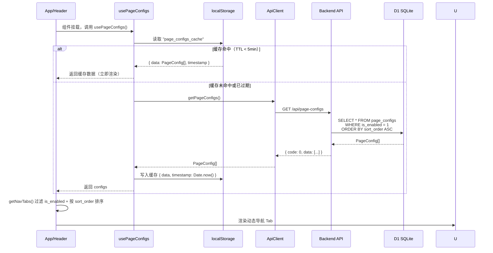
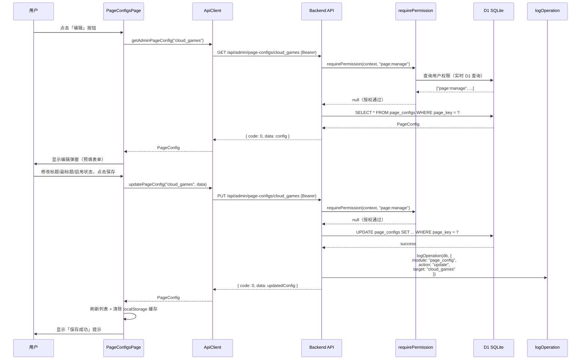
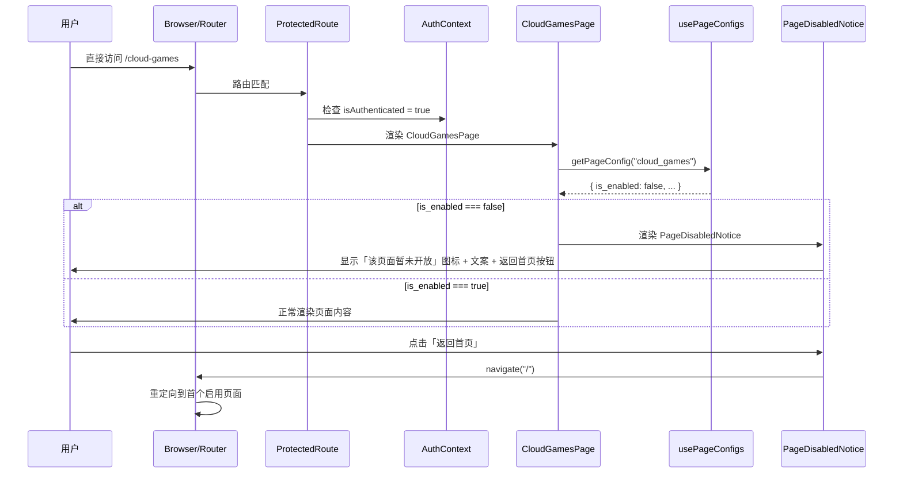
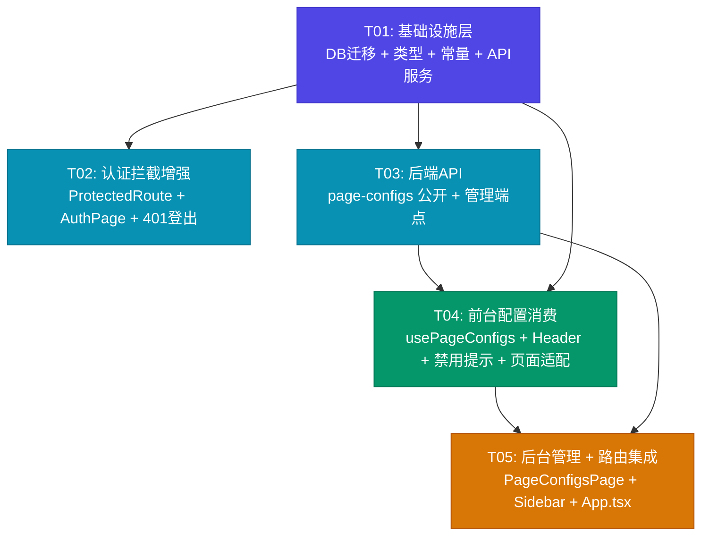

# 架构设计：全路由登录拦截 + 后台页面配置管理系统

> **项目名称**: cloudgame-hub
> **文档版本**: v1.0
> **编写日期**: 2026-07-09
> **架构师**: Bob (Software Architect)
> **技术栈**: Vite 5 + React 18 + TypeScript + Tailwind CSS + React Router v6 + Cloudflare Pages Functions + D1 SQLite

---

## Part A: 系统设计

### 1. 实现方案

#### 1.1 核心技术挑战

| # | 挑战 | 解决方案 |
|---|------|----------|
| C1 | 登录后精准返回原目标页面（含 query/hash） | ProtectedRoute 显式构造 `from: { pathname, search, hash }`；AuthPage 的 `getRedirectPath()` 拼接完整路径 |
| C2 | 运行时 Token 过期（401）自动登出 | 在 `ApiClient.request()` 中检测 HTTP 401 / response.code === 401，触发 `onUnauthorized` 回调；AuthContext 注册回调执行 logout + navigate |
| C3 | 外部链接点击未登录时丢失来源 | `useExternalLink` 跳转 `/login` 时传 `state={{ from: location }}` |
| C4 | 页面配置数据模型设计（兼顾可见性/文案/自定义参数） | `page_configs` 表：page_key 主键 + 文案字段 + params JSON + is_enabled + sort_order |
| C5 | 前台页面配置消费不阻塞首屏渲染 | usePageConfigs hook 异步加载 + localStorage 缓存（TTL 5 分钟）+ 硬编码默认值兜底 |
| C6 | 后台配置 CRUD 受 RBAC 权限保护 | 沿用现有 `requirePermission(context, 'page:manage')` 模式 |
| C7 | Header 导航 Tab 动态化（排序/可见性过滤） | 从 usePageConfigs 获取配置，过滤 `is_enabled`，按 `sort_order` 排序 |
| C8 | 禁用页面直接 URL 访问的友好提示 | 各前台页面组件内通过 `usePageConfigs` 检查 `is_enabled`，禁用时渲染 PageDisabledNotice |

#### 1.2 框架与库选型

**沿用现有技术栈，不引入新框架**。所有需求均可通过现有技术栈实现：

| 技术 | 用途 | 说明 |
|------|------|------|
| React Router v6 | 路由守卫、导航 | 已有 ProtectedRoute/AdminRoute 模式，扩展即可 |
| Cloudflare Pages Functions | 后端 API | 已有 `functions/api/` 目录 + `_middleware.ts` JWT 解析 |
| D1 SQLite | 数据存储 | 新增 `page_configs` 表，迁移脚本幂等执行 |
| Tailwind CSS | UI 样式 | 后台管理界面沿用现有 AdminLayout 风格 |
| lucide-react | 图标 | 新增 `LayoutTemplate` 图标用于侧边栏菜单 |
| Web Crypto API | JWT 签名/验证 | 已有 `functions/lib/auth.ts`，无需改动 |

**无需新增 npm 依赖**。所有功能在现有依赖范围内实现。

#### 1.3 架构模式

沿用项目现有的分层架构：

```
前端 (React SPA)
  ├── 路由层: ProtectedRoute / AdminRoute / PermissionRoute
  ├── 页面层: CloudGamesPage / PageConfigsPage
  ├── 组件层: Header / Sidebar / PageDisabledNotice
  ├── Hook层: useAuthContext / usePageConfigs
  ├── 服务层: ApiClient (api.ts)
  └── 类型层: types/pageConfig.ts

后端 (Cloudflare Pages Functions)
  ├── 中间件: _middleware.ts (JWT 解析)
  ├── 公开API: /api/page-configs
  ├── 管理API: /api/admin/page-configs
  └── 工具库: lib/{auth,permission,response,logger}

数据层 (D1 SQLite)
  └── page_configs 表 (新增)
```

---

### 2. 文件列表

#### 2.1 新增文件

| 相对路径 | 职责 |
|----------|------|
| `migrations/schema-page-configs.sql` | D1 迁移脚本：建 page_configs 表 + 索引 + 预置 6 页面数据 + 新增 page:manage 权限 + 超管授权 |
| `src/types/pageConfig.ts` | PageConfig、SavePageConfigRequest、NavTab 类型定义 |
| `src/hooks/usePageConfigs.ts` | 页面配置加载 hook：异步拉取 + localStorage 缓存(TTL 5min) + 查询辅助函数 |
| `src/components/PageDisabledNotice.tsx` | 禁用页面友好提示组件(图标 + 文案 + 返回首页按钮) |
| `src/pages/admin/PageConfigsPage.tsx` | 后台页面配置管理页：列表表格 + 编辑弹窗表单 |
| `functions/api/page-configs.ts` | 公开 API：GET 返回所有启用页面配置(前台消费) |
| `functions/api/admin/page-configs.ts` | 管理 API：GET 列表(含禁用) + POST 新建 |
| `functions/api/admin/page-configs/[key].ts` | 管理 API：GET / PUT / DELETE 单条配置 |

#### 2.2 修改文件

| 相对路径 | 改动说明 |
|----------|----------|
| `src/components/ProtectedRoute.tsx` | from 显式携带 { pathname, search, hash }，避免传递完整 location 对象 |
| `src/pages/AuthPage.tsx` | LocationState 类型扩展 search+hash；getRedirectPath() 拼接完整路径 |
| `src/hooks/useExternalLink.ts` | navigate("/login") 增加 state={{ from: location }} |
| `src/contexts/AuthContext.tsx` | 注册 onUnauthorized 回调到 ApiClient；回调执行 logout + navigate to /login(携带 from) |
| `src/services/api.ts` | request() 增加 401 检测 触发 onUnauthorized 回调；新增 page config API 方法 |
| `src/constants/permissions.ts` | ALL_PERMISSION_CODES 新增 page:manage；PERMISSION_GROUPS 新增 page 分组；NAV_PERMISSIONS 新增映射 |
| `src/types/index.ts` | re-export ./pageConfig |
| `src/components/admin/Sidebar.tsx` | secondaryNav 新增「页面配置」菜单项(icon: LayoutTemplate) |
| `src/components/Header.tsx` | 静态 TABS 数组改为从 usePageConfigs 动态读取(过滤 is_enabled + 按 sort_order 排序) |
| `src/App.tsx` | 注册 /admin/page-configs 路由；根路由 / 重定向改为动态首个启用页面 |
| `src/pages/CloudGamesPage.tsx` | Hero 标题/副标题从 usePageConfigs 读取，硬编码作为默认值兜底 |
| `src/pages/CloudDesktopsPage.tsx` | 同上 |
| `src/pages/DealsPage.tsx` | 同上 |
| `src/pages/LibraryPage.tsx` | 同上 |
| `src/pages/FreeGamesPage.tsx` | 同上 |
| `src/pages/SmsPlatformsPage.tsx` | 同上 |
| `schema.sql` | 同步追加 page_configs 表结构定义(保持文档一致性) |

---

### 3. 数据结构和接口

#### 3.1 类图（Class Diagram）



#### 3.2 核心类型定义

```typescript
// src/types/pageConfig.ts

/** 页面配置完整数据模型（与 D1 page_configs 表对应）。 */
export interface PageConfig {
  id: number;
  page_key: string;        // 唯一标识，如 "cloud_games"
  title: string;            // 页面主标题
  subtitle: string;         // 页面副标题
  is_enabled: boolean;      // 是否启用（前台可见）
  path: string;             // 前台路由路径，如 "/cloud-games"
  params: string;           // JSON 字符串，自定义参数
  sort_order: number;       // 排序权重（升序）
  created_at: string;       // ISO 8601
  updated_at: string;       // ISO 8601
}

/** 后台创建/编辑页面配置时的请求体。 */
export interface SavePageConfigRequest {
  title: string;
  subtitle: string;
  is_enabled: boolean;
  path: string;
  params: Record<string, unknown>;
  sort_order: number;
}

/** Header 导航 Tab 数据（从 PageConfig 映射而来）。 */
export interface NavTab {
  path: string;
  label: string;
  sort_order: number;
}
```

#### 3.3 D1 数据库表结构（page_configs）

```sql
-- migrations/schema-page-configs.sql

CREATE TABLE IF NOT EXISTS page_configs (
  id INTEGER PRIMARY KEY AUTOINCREMENT,
  page_key TEXT UNIQUE NOT NULL,
  title TEXT NOT NULL DEFAULT '',
  subtitle TEXT NOT NULL DEFAULT '',
  is_enabled INTEGER NOT NULL DEFAULT 1,
  path TEXT NOT NULL DEFAULT '',
  params TEXT NOT NULL DEFAULT '{}',
  sort_order INTEGER NOT NULL DEFAULT 0,
  created_at TEXT NOT NULL DEFAULT (datetime('now')),
  updated_at TEXT NOT NULL DEFAULT (datetime('now'))
);

CREATE INDEX IF NOT EXISTS idx_page_configs_enabled
  ON page_configs(is_enabled, sort_order);

-- 预置 6 个页面配置
INSERT OR IGNORE INTO page_configs
  (page_key, title, subtitle, is_enabled, path, params, sort_order) VALUES
  ('cloud_games',    '云游戏',   '随时随地，畅玩3A大作',         1, '/cloud-games',    '{}', 1),
  ('cloud_desktops', '云电脑',   '高性能办公云电脑',             1, '/cloud-desktops', '{}', 2),
  ('deals',          '薅羊毛',   '精选优惠，天天省钱',           1, '/deals',          '{}', 3),
  ('library',        '游戏库',   '海量游戏，一键直达',           1, '/library',        '{}', 4),
  ('free_games',     '免费游戏', '限时免费，先到先得',           1, '/free-games',     '{}', 5),
  ('sms_platforms',  '短信平台', '游戏福利短信平台入口',         1, '/sms-platforms',  '{}', 6);

-- 新增 page:manage 权限
INSERT OR IGNORE INTO permissions (code, name, module, action, sort_order) VALUES
  ('page:manage', '管理页面配置', 'page', 'manage', 14);

-- 超级管理员自动获得 page:manage 权限
INSERT OR IGNORE INTO role_permissions (role_id, permission_id)
  SELECT r.id, p.id FROM roles r, permissions p
  WHERE r.code = 'super_admin' AND p.code = 'page:manage';
```

#### 3.4 API 端点设计

| 方法 | 路径 | 权限 | 说明 |
|------|------|------|------|
| GET | `/api/page-configs` | 无需认证 | 前台公开接口：返回所有 `is_enabled=1` 的配置，按 `sort_order` 升序 |
| GET | `/api/admin/page-configs` | `page:manage` | 后台列表：返回全部配置（含禁用），按 `sort_order` 升序 |
| GET | `/api/admin/page-configs/[key]` | `page:manage` | 后台详情：返回单条配置 |
| POST | `/api/admin/page-configs` | `page:manage` | 新建配置：body = `SavePageConfigRequest` |
| PUT | `/api/admin/page-configs/[key]` | `page:manage` | 更新配置：body = `SavePageConfigRequest` |
| DELETE | `/api/admin/page-configs/[key]` | `page:manage` | 删除配置 |

**统一响应格式**（所有端点）：
```typescript
{ code: number; data: T | null; message: string }
// code = 0 表示成功，非 0 表示错误
```

#### 3.5 ApiClient 新增方法签名

```typescript
// src/services/api.ts — 新增部分

export class ApiClient {
  /** 401 未授权回调（由 AuthContext 注册，触发自动登出）。 */
  onUnauthorized: (() => void) | null = null;

  // 在 request<T>() 方法中增加 401 检测：
  // const response = await fetch(path, { ...options, headers });
  // const result = await response.json() as ApiResponse<T>;
  // if (response.status === 401 || result.code === 401) {
  //   this.onUnauthorized?.();
  // }
  // return result;

  // ── Page Config Endpoints ──────────────────────────────

  /** 前台：获取所有启用的页面配置。 */
  async getPageConfigs(): Promise<PageConfig[]> {
    const res = await this.request<PageConfig[]>("/api/page-configs");
    if (res.code !== 0) throw new Error(res.message);
    return res.data ?? [];
  }

  /** 后台：获取全部页面配置（含禁用）。 */
  async getAdminPageConfigs(): Promise<PageConfig[]> {
    const res = await this.request<PageConfig[]>("/api/admin/page-configs");
    if (res.code !== 0) throw new Error(res.message);
    return res.data ?? [];
  }

  /** 后台：获取单条页面配置。 */
  async getAdminPageConfig(key: string): Promise<PageConfig> {
    const res = await this.request<PageConfig>(`/api/admin/page-configs/${key}`);
    if (res.code !== 0) throw new Error(res.message);
    return res.data;
  }

  /** 后台：新建页面配置。 */
  async createPageConfig(data: SavePageConfigRequest): Promise<PageConfig> {
    const res = await this.request<PageConfig>("/api/admin/page-configs", {
      method: "POST",
      body: JSON.stringify(data),
    });
    if (res.code !== 0) throw new Error(res.message);
    return res.data;
  }

  /** 后台：更新页面配置。 */
  async updatePageConfig(key: string, data: SavePageConfigRequest): Promise<PageConfig> {
    const res = await this.request<PageConfig>(`/api/admin/page-configs/${key}`, {
      method: "PUT",
      body: JSON.stringify(data),
    });
    if (res.code !== 0) throw new Error(res.message);
    return res.data;
  }

  /** 后台：删除页面配置。 */
  async deletePageConfig(key: string): Promise<void> {
    const res = await this.request<null>(`/api/admin/page-configs/${key}`, {
      method: "DELETE",
    });
    if (res.code !== 0) throw new Error(res.message);
  }
}
```

#### 3.6 usePageConfigs Hook 接口

```typescript
// src/hooks/usePageConfigs.ts

interface UsePageConfigsResult {
  configs: PageConfig[];                    // 全部配置（含禁用）
  loading: boolean;                         // 加载状态
  getPageConfig: (key: string) => PageConfig | null;  // 按 page_key 查询
  getNavTabs: () => NavTab[];               // 获取导航 Tab 列表（仅启用，已排序）
  refresh: () => Promise<void>;             // 强制刷新（清除缓存后重新拉取）
}

export function usePageConfigs(): UsePageConfigsResult { ... }
```

**缓存策略**：
- localStorage key: `page_configs_cache`
- 缓存格式: `{ data: PageConfig[], timestamp: number }`
- TTL: 5 分钟（300000ms）
- `refresh()` 方法清除缓存并重新拉取

---

### 4. 程序调用流程

#### 4.1 路由拦截 + 登录后精准返回



#### 4.2 运行时 401 自动登出



#### 4.3 页面配置加载流程（usePageConfigs）



#### 4.4 后台编辑/保存页面配置



#### 4.5 禁用页面直接 URL 访问提示



---

### 5. 待明确事项

| # | 待明确事项 | 当前假设 |
|---|-----------|----------|
| Q1 | `page_configs.params` 字段的具体用途尚未在前台消费 | 预留为 JSON 字符串，当前前台页面仅读取 title/subtitle，params 暂不解析；后续可扩展为页面级自定义参数 |
| Q2 | 根路由 `/` 重定向目标的确定时机 | 假设使用 `usePageConfigs` 获取首个 `is_enabled=1` 的页面 path 作为重定向目标；若配置未加载完成则 fallback 到 `/cloud-games` |
| Q3 | 后台编辑后前台缓存刷新的实时性 | 假设编辑成功后清除 localStorage 缓存，下次前台访问时自动重新拉取；不做 WebSocket/SSE 实时推送 |
| Q4 | `page_key` 与前台路由 path 的映射关系是否需要后台维护 | 假设 `page_configs.path` 字段即为前台路由路径，两者一一对应；不引入额外映射表 |
| Q5 | 外部链接跳转（useExternalLink）的 `from` 传递是否需要保留 query/hash | 假设需要完整保留，与 ProtectedRoute 行为一致 |
| Q6 | 401 自动登出后是否需要显示「登录已过期」提示 | 假设在 AuthPage 检测到 from state 且有 401 标记时显示提示文案；可通过 navigate state 传递 `expired: true` 标记 |

---

## Part B: 任务分解

### 6. 依赖包列表

**无需新增任何 npm 依赖**。所有功能在现有技术栈范围内实现：

```
# 已有依赖（无需变更）
- react@^18.2.0: UI 框架
- react-router-dom@^6.x: 路由与导航
- lucide-react@^0.x: 图标库（使用现有 LayoutTemplate 图标）
- typescript@^5.x: 类型系统

# 后端无新增依赖（Cloudflare Pages Functions 原生运行时）
- Web Crypto API: JWT 签名/验证（已有 functions/lib/auth.ts）
- D1 Database: SQLite 数据存储（已有绑定）
```

---

### 7. 任务列表（按依赖顺序）

#### T01: 基础设施层 — DB迁移 + 类型定义 + 权限常量 + API服务层

- **Task ID**: T01
- **优先级**: P0
- **依赖**: 无
- **源文件**:
  - `migrations/schema-page-configs.sql`（新建：建表 + 索引 + 预置6页面 + page:manage权限 + 超管授权）
  - `src/types/pageConfig.ts`（新建：PageConfig、SavePageConfigRequest、NavTab 接口）
  - `src/types/index.ts`（修改：re-export ./pageConfig）
  - `src/constants/permissions.ts`（修改：ALL_PERMISSION_CODES 新增 page:manage；PERMISSION_GROUPS 新增 page 分组；NAV_PERMISSIONS 新增 /admin/page-configs 映射）
  - `src/services/api.ts`（修改：request() 增加 401 检测 + onUnauthorized 回调属性；新增 6 个 page config API 方法）
- **验收标准**:
  - 迁移脚本可幂等执行（CREATE TABLE IF NOT EXISTS / INSERT OR IGNORE）
  - TypeScript 类型编译无错误
  - ApiClient.onUnauthorized 属性存在且默认为 null
  - request() 方法在收到 HTTP 401 或 response.code === 401 时触发 onUnauthorized

---

#### T02: 认证拦截增强 — 路由守卫 + 登录返回 + 401自动登出

- **Task ID**: T02
- **优先级**: P0
- **依赖**: T01
- **源文件**:
  - `src/components/ProtectedRoute.tsx`（修改：from 显式携带 { pathname, search, hash }，避免传递完整 location 对象）
  - `src/pages/AuthPage.tsx`（修改：LocationState 类型扩展 search+hash；getRedirectPath() 拼接 pathname+search+hash 完整路径）
  - `src/hooks/useExternalLink.ts`（修改：navigate("/login") 增加 state={{ from: location }}）
  - `src/contexts/AuthContext.tsx`（修改：新增 handleUnauthorized 方法注册到 apiClient.onUnauthorized；执行 logout + navigate to /login）
- **验收标准**:
  - 未登录访问 `/cloud-desktops?filter=gaming#section1` → 登录后返回同一完整 URL
  - 运行时 Token 过期（API 返回 401）→ 自动清除登录态并跳转 /login
  - useExternalLink 未登录跳转 /login 后，登录成功可返回原页面

---

#### T03: 后端API — 公开 + 管理端 page-configs 端点

- **Task ID**: T03
- **优先级**: P0
- **依赖**: T01
- **源文件**:
  - `functions/api/page-configs.ts`（新建：GET 公开接口，返回 is_enabled=1 的配置，按 sort_order 升序）
  - `functions/api/admin/page-configs.ts`（新建：GET 列表含禁用 + POST 新建，requirePermission 鉴权）
  - `functions/api/admin/page-configs/[key].ts`（新建：GET / PUT / DELETE 单条配置，requirePermission 鉴权，logOperation 记录操作日志）
  - `schema.sql`（修改：同步追加 page_configs 表结构定义，保持文档一致性）
- **验收标准**:
  - GET /api/page-configs 无需认证，返回启用配置列表
  - GET /api/admin/page-configs 需 page:manage 权限，返回全部配置
  - POST/PUT/DELETE 操作后写入 operation_logs 表
  - 所有端点返回统一 { code, data, message } 格式

---

#### T04: 前台页面配置消费 — Hook + 动态导航 + 禁用提示 + 页面适配

- **Task ID**: T04
- **优先级**: P0
- **依赖**: T01, T03
- **源文件**:
  - `src/hooks/usePageConfigs.ts`（新建：异步加载 + localStorage 缓存 TTL 5min + getPageConfig/getNavTabs/refresh 方法）
  - `src/components/PageDisabledNotice.tsx`（新建：禁用页面提示组件，图标 + 文案 + 返回首页按钮）
  - `src/components/Header.tsx`（修改：静态 TABS 改为从 usePageConfigs 动态读取，过滤 is_enabled + 按 sort_order 排序）
  - `src/pages/CloudGamesPage.tsx`（修改：Hero 标题/副标题从 usePageConfigs 读取，硬编码兜底；is_enabled=false 时渲染 PageDisabledNotice）
  - `src/pages/CloudDesktopsPage.tsx`（修改：同上）
  - `src/pages/DealsPage.tsx`（修改：同上）
  - `src/pages/LibraryPage.tsx`（修改：同上）
  - `src/pages/FreeGamesPage.tsx`（修改：同上）
  - `src/pages/SmsPlatformsPage.tsx`（修改：同上）
- **验收标准**:
  - Header 导航 Tab 从后端配置动态渲染
  - 页面标题/副标题从配置读取，配置未加载时使用硬编码默认值
  - 禁用页面直接 URL 访问时显示 PageDisabledNotice
  - localStorage 缓存命中时不发起网络请求

---

#### T05: 后台管理界面 + 路由集成

- **Task ID**: T05
- **优先级**: P0
- **依赖**: T01, T03, T04
- **源文件**:
  - `src/pages/admin/PageConfigsPage.tsx`（新建：列表表格 + 编辑弹窗表单，支持新建/编辑/删除/切换启用状态）
  - `src/components/admin/Sidebar.tsx`（修改：secondaryNav 新增「页面配置」菜单项，icon: LayoutTemplate）
  - `src/App.tsx`（修改：注册 /admin/page-configs 路由（PermissionRoute 包裹）；根路由 / 重定向改为动态首个启用页面）
- **验收标准**:
  - 后台侧边栏显示「页面配置」菜单项（仅有 page:manage 权限时可见）
  - 列表页展示全部配置（含禁用），支持编辑/删除/新建
  - 编辑保存后自动刷新列表并清除前台 localStorage 缓存
  - 根路由 / 重定向到首个启用页面

---

### 8. 共享知识

以下约定贯穿所有任务，工程师实现时需遵循：

```
# API 响应格式
- 所有 API 返回统一信封：{ code: number, data: T | null, message: string }
- code = 0 表示成功，非 0 表示错误
- HTTP status code 与 code 字段保持一致（401/403/404/400/500）

# 认证机制
- JWT token 存储在 localStorage key "cloudgame_hub_token"
- 请求头格式：Authorization: Bearer <token>
- _middleware.ts 解析 JWT 并注入 context.data.user
- Token 过期判断：前端 isTokenExpired() 检查 exp 字段；后端 Web Crypto 验证签名

# 权限控制
- 后端鉴权：requirePermission(context, code) 返回 Response | null
- 前端路由：PermissionRoute 包裹需权限的路由
- 侧边栏过滤：useFilteredNav() 根据 user.permissions 过滤菜单项
- 新增权限码 page:manage 需在 permissions.ts 和 schema-page-configs.sql 中同步

# 数据库
- D1 SQLite，迁移脚本幂等（IF NOT EXISTS / OR IGNORE）
- 日期格式：ISO 8601 UTC，D1 默认 datetime('now')
- 布尔值存储为 INTEGER（0/1），前端用 boolean

# 页面配置缓存
- localStorage key: "page_configs_cache"
- 缓存格式: { data: PageConfig[], timestamp: number }
- TTL: 5 分钟（300000ms）
- 后台编辑/删除后需清除缓存：localStorage.removeItem("page_configs_cache")

# 路由守卫 from state
- ProtectedRoute 传递: { pathname, search, hash }（不传完整 location 对象）
- AuthPage 读取: state?.from?.pathname + state?.from?.search + state?.from?.hash
- 默认重定向: "/cloud-games"（fallback）

# 401 自动登出
- ApiClient.onUnauthorized 回调由 AuthProvider 初始化时注册
- 回调执行：logout() + navigate("/login", { state: { from: location } })
- 防重复触发：onUnauthorized 调用后立即置 null（避免并发请求多次触发）

# 操作日志
- 所有后台写操作（POST/PUT/DELETE）调用 logOperation(db, params)
- 日志模块名: "page_config"
- 日志动作: "create" / "update" / "delete"
```

---

### 9. 任务依赖图



**依赖关系说明**：

| 任务 | 依赖 | 原因 |
|------|------|------|
| T01 | 无 | 基础层：类型定义和迁移脚本被所有后续任务引用 |
| T02 | T01 | AuthContext 需注册 ApiClient.onUnauthorized（T01 中新增） |
| T03 | T01 | 后端端点依赖 page_configs 表（T01 迁移）和 PageConfig 类型（T01 定义） |
| T04 | T01, T03 | usePageConfigs 调用 ApiClient.getPageConfigs（T01）请求后端端点（T03） |
| T05 | T01, T03, T04 | PageConfigsPage 调用 Admin API（T01+T03）；App.tsx 路由依赖 Header 动态化（T04） |

**并行可能性**：T02 和 T03 互不依赖，可并行开发。

---

> **文档结束** — 以上架构设计覆盖 PRD-auth-admin.md 的全部 P0 需求（P0-1 至 P0-9），任务分解为 5 个有序任务，每个任务包含 3+ 个相关文件，遵循模块化分组原则。
