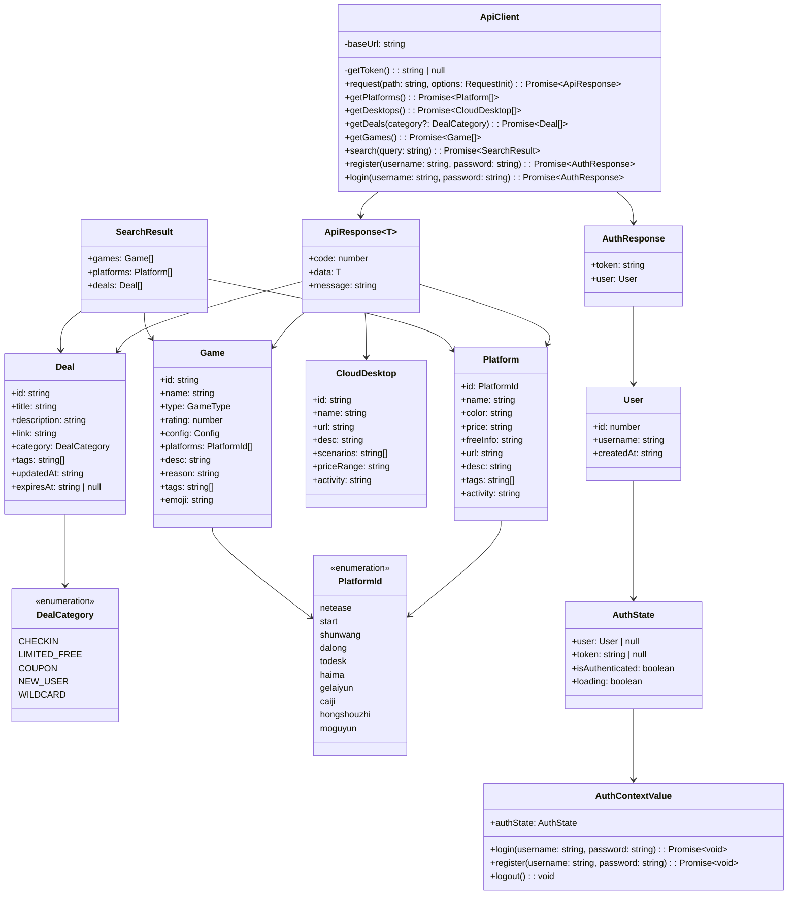
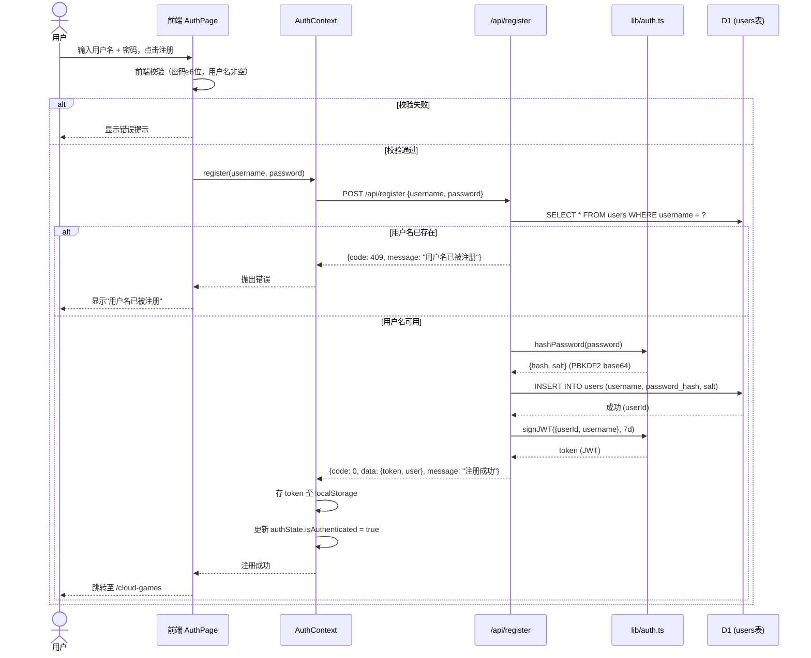
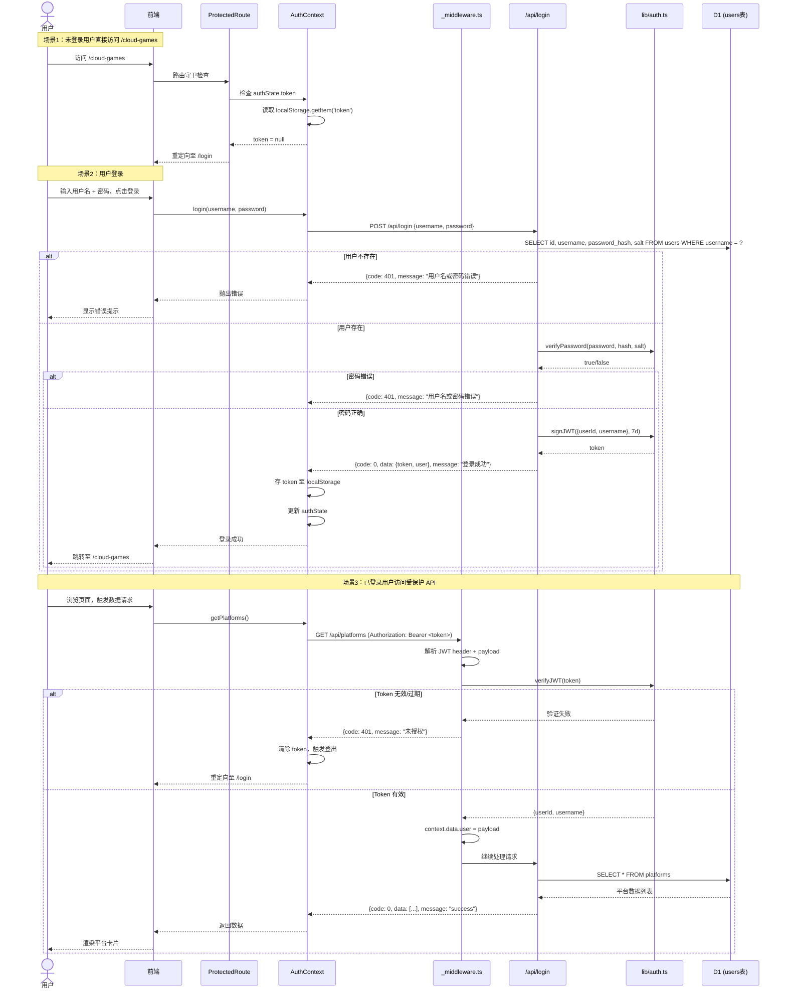
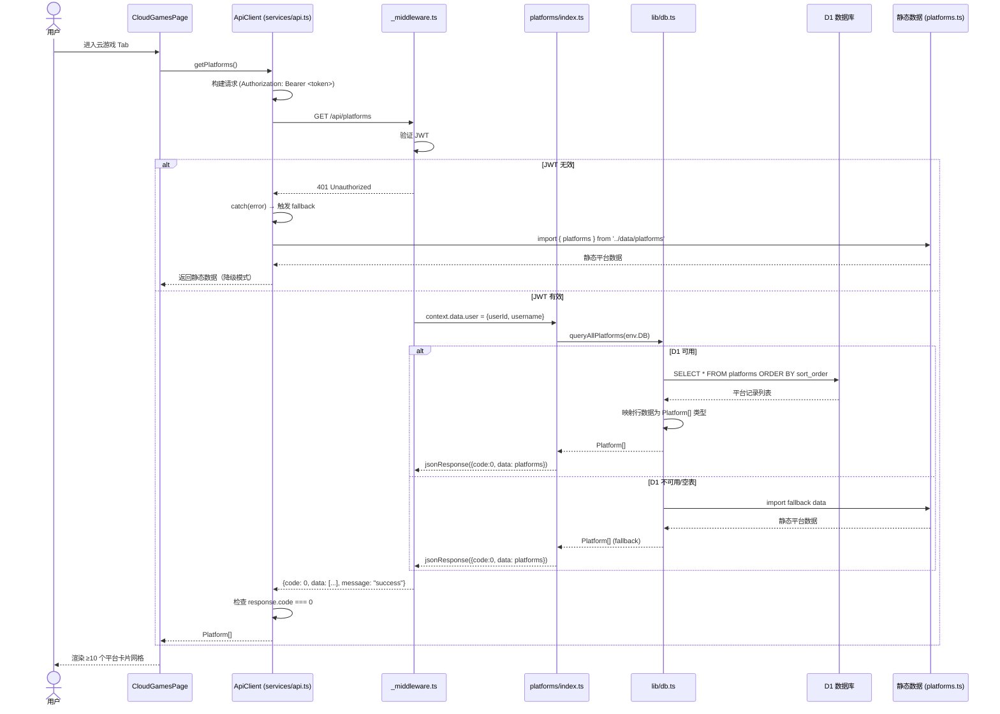
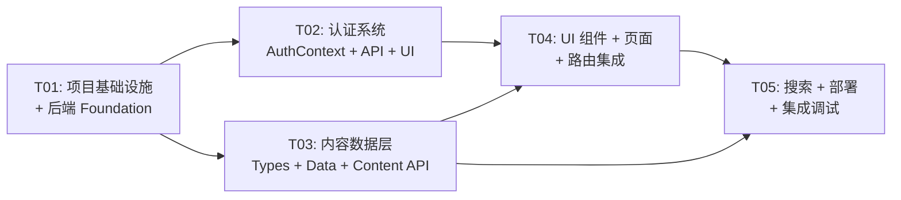

# 架构设计文档 — 云玩汇 2.0

> **版本**：v2.0 | **日期**：2025-07-06 | **架构师**：高见远（Gao）

---

## 目录

1. [实现方案与框架选型](#1-实现方案与框架选型)
2. [文件列表及相对路径](#2-文件列表及相对路径)
3. [数据结构和接口（类图）](#3-数据结构和接口类图)
4. [程序调用流程（时序图）](#4-程序调用流程时序图)
5. [任务列表（有序、含依赖关系）](#5-任务列表有序含依赖关系)
6. [依赖包列表](#6-依赖包列表)
7. [共享知识（跨文件约定）](#7-共享知识跨文件约定)
8. [待明确事项](#8-待明确事项)

---

## 1. 实现方案与框架选型

### 1.1 核心技术挑战

| 挑战 | 分析 | 方案 |
|------|------|------|
| **Workers 中密码哈希** | Cloudflare Workers 免费版 CPU 时间限制 10ms/请求，传统 bcrypt cost=10 约需 80-100ms CPU 时间，超限 | 使用 Web Crypto API 原生 `PBKDF2`（SHA-256, 100000 次迭代），零依赖、CPU 友好、安全性达标 |
| **JWT 签发/校验** | Workers 环境无 Node.js `crypto` 模块，`jsonwebtoken` 包不兼容 | 使用 `jose` 库（基于 Web Crypto API，专为 Edge Runtime 设计） |
| **前后端同仓库部署** | Pages 静态前端 + Workers API 需协同部署 | 采用 **Cloudflare Pages Functions** 模式：`functions/` 目录即 Workers，与前端同一 Pages 项目一键部署 |
| **数据源 D1 迁移 + 静态 Fallback** | D1 未初始化或 API 异常时前端不可白屏 | API 端先查 D1，D1 不可用时回退静态 TS 数据；前端 API 调用失败时也回退本地静态数据 |
| **路由守卫 + Token 管理** | 未登录用户访问受保护页需重定向 | React Router v6 `ProtectedRoute` 组件 + `AuthContext` 全局状态 + `localStorage` 持久化 Token |

### 1.2 Cloudflare 全家桶架构图

```
                    ┌─────────────────────────────────┐
                    │        用户浏览器（客户端）        │
                    │  Vite + React + React Router v6   │
                    └───────────────┬─────────────────┘
                          HTTPS │
                    ┌───────────▼───────────────────┐
                    │   Cloudflare CDN / 边缘节点    │
                    │   （自定义域名 + HTTPS 证书）     │
                    └───────────┬───────────────────┘
                                │
              ┌─────────────────▼─────────────────┐
              │     Cloudflare Pages 项目          │
              │  ┌─────────────────────────────┐  │
              │  │   静态前端（dist/ 构建产物）    │  │
              │  │   Vite build → HTML/JS/CSS   │  │
              │  └──────────────┬──────────────┘  │
              │                 │                 │
              │  ┌──────────────▼──────────────┐  │
              │  │  Pages Functions（Workers）   │  │
              │  │  functions/api/*.ts          │  │
              │  │  ┌─────────────────────────┐ │  │
              │  │  │  Auth Middleware        │ │  │
              │  │  │  (JWT 校验 / CORS)     │ │  │
              │  │  └───────────┬─────────────┘ │  │
              │  │              │                │  │
              │  │  ┌───────────▼─────────────┐ │  │
              │  │  │  API Route Handlers      │ │  │
              │  │  │  register/login/logout   │ │  │
              │  │  │  platforms/desktops      │ │  │
              │  │  │  deals/games/search      │ │  │
              │  │  └───────────┬─────────────┘ │  │
              │  └──────────────┼───────────────┘  │
              └─────────────────┼──────────────────┘
                                │ D1 Binding (env.DB)
                    ┌───────────▼───────────────────┐
                    │      Cloudflare D1 (SQLite)     │
                    │  users / platforms /            │
                    │  cloud_desktops / deals /      │
                    │  favorites                     │
                    └───────────────────────────────┘
```

### 1.3 Workers API 路由设计

所有 API 统一前缀 `/api`，由 Pages Functions 文件路由映射：

| 方法 | 路径 | 文件 | 认证 | 说明 |
|------|------|------|------|------|
| POST | `/api/register` | `functions/api/register.ts` | 否 | 注册用户，返回 JWT |
| POST | `/api/login` | `functions/api/login.ts` | 否 | 登录，返回 JWT |
| POST | `/api/logout` | `functions/api/logout.ts` | 是 | 登出（前端清除 Token 即可，后端可选记录） |
| GET | `/api/me` | `functions/api/me.ts` | 是 | 获取当前用户信息 |
| GET | `/api/platforms` | `functions/api/platforms/index.ts` | 是 | 获取全部云游戏平台（≥10） |
| GET | `/api/platforms/:id` | `functions/api/platforms/[id].ts` | 是 | 获取单个平台详情 |
| GET | `/api/desktops` | `functions/api/desktops.ts` | 是 | 获取全部办公云电脑（≥5） |
| GET | `/api/deals` | `functions/api/deals/index.ts` | 是 | 获取全部薅羊毛信息（支持 `?category=` 筛选） |
| GET | `/api/games` | `functions/api/games.ts` | 是 | 获取全部游戏列表 |
| GET | `/api/search?q=` | `functions/api/search.ts` | 是 | 全局搜索（游戏/平台/薅羊毛） |
| GET | `/api/favorites` | `functions/api/favorites/index.ts` | 是 | 获取用户收藏列表（P2） |
| POST | `/api/favorites` | `functions/api/favorites/index.ts` | 是 | 添加收藏（P2） |
| DELETE | `/api/favorites/:id` | `functions/api/favorites/[id].ts` | 是 | 删除收藏（P2） |

### 1.4 前端路由设计（React Router v6）

```
/login                          → AuthPage（公开）
/                               → 重定向至 /cloud-games
/cloud-games                    → CloudGamesPage（受保护）
/cloud-desktops                 → CloudDesktopsPage（受保护）
/deals                          → DealsPage（受保护）
/library                        → LibraryPage（受保护）
/search                         → SearchPage（受保护）
*                               → 重定向至 /cloud-games
```

路由守卫：`<ProtectedRoute>` 组件包裹所有非 `/login` 路由，检查 `AuthContext` 中的 Token 有效性，无效则重定向至 `/login`。

### 1.5 认证流程设计

#### 注册流程
1. 用户在 AuthPage 填写用户名 + 密码 → 前端校验密码 ≥6 位
2. `POST /api/register { username, password }`
3. Workers 校验用户名唯一性 → PBKDF2 哈希密码 → 存入 D1 `users` 表
4. 签发 JWT（含 `userId`, `username`, `exp`），有效期 7 天
5. 返回 `{ code: 0, data: { token, user }, message: "注册成功" }`
6. 前端存 Token 至 `localStorage`，更新 `AuthContext`，跳转至 `/cloud-games`

#### 登录流程
1. 用户在 AuthPage 填写用户名 + 密码
2. `POST /api/login { username, password }`
3. Workers 查 D1 取 `password_hash` + `salt` → PBKDF2 校验
4. 校验通过 → 签发 JWT → 返回 Token
5. 校验失败 → 返回 `{ code: 401, message: "用户名或密码错误" }`

#### Token 校验
- 前端：每次 API 请求在 `Authorization: Bearer <token>` 头部携带 Token
- 后端：`functions/_middleware.ts` 解析 JWT，校验签名和过期时间，将 `userId` 注入 `context.data.user`
- 前端路由守卫：解码 JWT payload（不验签）检查 `exp`，过期则清除 Token 并重定向

#### 登出流程
1. 用户点击 Header 中的"登出"按钮
2. 前端清除 `localStorage` 中的 Token
3. 更新 `AuthContext` 状态为未登录
4. 跳转至 `/login`

---

## 2. 文件列表及相对路径

### 按模块分组

#### config — 项目配置（修改现有）

| 文件 | 状态 | 说明 |
|------|------|------|
| `package.json` | [修改] | 新增 react-router-dom, jose, bcryptjs, wrangler 等依赖 |
| `vite.config.ts` | [修改] | 添加 `/api` 代理至本地 wrangler dev 端口 |
| `tsconfig.json` | [修改] | 添加 functions 目录类型声明 |
| `wrangler.toml` | [新建] | Pages 项目配置 + D1 binding + 环境变量 |
| `schema.sql` | [新建] | D1 数据库建表 DDL |

#### src — 前端源码

**入口与路由**

| 文件 | 状态 | 说明 |
|------|------|------|
| `src/main.tsx` | [修改] | 引入 BrowserRouter 包裹 App |
| `src/App.tsx` | [修改] | 重构为路由配置 + ProtectedRoute 包裹 |
| `src/index.css` | [保留] | 无修改 |

**types — 类型定义**

| 文件 | 状态 | 说明 |
|------|------|------|
| `src/types/index.ts` | [修改] | 扩展 PlatformId 枚举、新增 CloudDesktop, Deal, User, DealCategory 等类型 |

**data — 静态数据（D1 fallback）**

| 文件 | 状态 | 说明 |
|------|------|------|
| `src/data/platforms.ts` | [修改] | 扩充至 ≥10 个平台，新增 tags/activity 字段 |
| `src/data/games.ts` | [保留] | 29 款游戏数据不变 |
| `src/data/desktops.ts` | [新建] | ≥5 个办公云电脑静态数据 |
| `src/data/deals.ts` | [新建] | 薅羊毛信息静态数据（5 子类） |

**contexts — 全局状态**

| 文件 | 状态 | 说明 |
|------|------|------|
| `src/contexts/AuthContext.tsx` | [新建] | 用户认证状态管理：login/register/logout/getCurrentUser |

**services — API 客户端**

| 文件 | 状态 | 说明 |
|------|------|------|
| `src/services/api.ts` | [新建] | 封装 fetch 请求，自动携带 JWT、统一错误处理、静态数据 fallback |

**components — UI 组件**

| 文件 | 状态 | 说明 |
|------|------|------|
| `src/components/Header.tsx` | [修改] | 重构为 4 Tab 导航 + 搜索按钮 + 登出按钮 + 移动端汉堡菜单 |
| `src/components/FilterBar.tsx` | [保留] | 沿用现有筛选栏 |
| `src/components/GameCard.tsx` | [保留] | 沿用现有游戏卡片 |
| `src/components/GameModal.tsx` | [保留] | 沿用现有游戏详情弹窗 |
| `src/components/PlatformBar.tsx` | [修改] | 重命名为 PlatformCard，重构为可点击打开详情弹窗的卡片 |
| `src/components/PlatformModal.tsx` | [新建] | 平台详情弹窗（名称/简介/标签/价格/免费额度/活动/官网直达） |
| `src/components/DesktopCard.tsx` | [新建] | 办公云电脑卡片组件 |
| `src/components/DealCard.tsx` | [新建] | 薅羊毛信息卡片（含时效标注、过期灰色标记） |
| `src/components/DealFilter.tsx` | [新建] | 薅羊毛子类筛选栏（5 类 + 全部） |
| `src/components/SearchBar.tsx` | [新建] | 全局搜索输入框 + 搜索结果下拉 |
| `src/components/ProtectedRoute.tsx` | [新建] | 路由守卫组件 |
| `src/components/TipsSection.tsx` | [保留] | 沿用现有攻略区块 |
| `src/components/Footer.tsx` | [新建] | 提取 Footer 为独立组件 |

**pages — 页面组件**

| 文件 | 状态 | 说明 |
|------|------|------|
| `src/pages/AuthPage.tsx` | [新建] | 登录/注册页（Tab 切换，居中卡片式） |
| `src/pages/CloudGamesPage.tsx` | [新建] | 云游戏 Tab 页（Hero + 平台卡片网格 + 平台详情弹窗） |
| `src/pages/CloudDesktopsPage.tsx` | [新建] | 云电脑 Tab 页（Hero + 桌面平台卡片网格） |
| `src/pages/DealsPage.tsx` | [新建] | 薅羊毛 Tab 页（子类筛选 + 信息卡片流） |
| `src/pages/LibraryPage.tsx` | [新建] | 游戏库 Tab 页（沿用现有筛选 + 游戏网格 + 游戏详情弹窗） |
| `src/pages/SearchPage.tsx` | [新建] | 搜索结果页（分类展示游戏/平台/薅羊毛） |

**hooks — 自定义 Hook**

| 文件 | 状态 | 说明 |
|------|------|------|
| `src/hooks/useAuth.ts` | [新建] | 便捷 Hook 包装 AuthContext |

#### functions — Cloudflare Pages Functions（后端 API）

| 文件 | 状态 | 说明 |
|------|------|------|
| `functions/_middleware.ts` | [新建] | 全局中间件：CORS 头注入 + JWT 解析（注入 context.data.user） |
| `functions/lib/response.ts` | [新建] | 统一 API 响应工具函数 `jsonResponse()` / `errorResponse()` |
| `functions/lib/db.ts` | [新建] | D1 查询封装 + 静态数据 fallback 逻辑 |
| `functions/lib/auth.ts` | [新建] | PBKDF2 哈希/校验 + JWT 签发/验证（基于 jose + Web Crypto） |
| `functions/api/register.ts` | [新建] | POST /api/register |
| `functions/api/login.ts` | [新建] | POST /api/login |
| `functions/api/logout.ts` | [新建] | POST /api/logout |
| `functions/api/me.ts` | [新建] | GET /api/me |
| `functions/api/platforms/index.ts` | [新建] | GET /api/platforms |
| `functions/api/platforms/[id].ts` | [新建] | GET /api/platforms/:id |
| `functions/api/desktops.ts` | [新建] | GET /api/desktops |
| `functions/api/deals/index.ts` | [新建] | GET /api/deals（支持 ?category= 筛选） |
| `functions/api/games.ts` | [新建] | GET /api/games |
| `functions/api/search.ts` | [新建] | GET /api/search?q= |
| `functions/api/favorites/index.ts` | [新建] | GET/POST /api/favorites（P2） |
| `functions/api/favorites/[id].ts` | [新建] | DELETE /api/favorites/:id（P2） |

#### docs — 文档

| 文件 | 状态 | 说明 |
|------|------|------|
| `docs/ARCHITECTURE.md` | [新建] | 本文档 |
| `docs/PRD.md` | [保留] | 产品需求文档 |

---

## 3. 数据结构和接口（类图）

### 3.1 D1 数据库表结构（SQL DDL）

```sql
-- ============================================
-- Cloudflare D1 Schema for cloudgame-hub v2.0
-- ============================================

-- 用户表
CREATE TABLE IF NOT EXISTS users (
  id            INTEGER PRIMARY KEY AUTOINCREMENT,
  username      TEXT    UNIQUE NOT NULL,
  password_hash TEXT    NOT NULL,    -- PBKDF2 哈希值（base64）
  salt          TEXT    NOT NULL,    -- PBKDF2 盐值（base64）
  created_at    TEXT    NOT NULL DEFAULT (datetime('now'))
);

-- 云游戏平台表
CREATE TABLE IF NOT EXISTS platforms (
  id          TEXT    PRIMARY KEY,
  name        TEXT    NOT NULL,
  color       TEXT    NOT NULL,
  price       TEXT    NOT NULL,
  free_info   TEXT    NOT NULL,
  url         TEXT    NOT NULL,
  description TEXT    NOT NULL,
  tags        TEXT    DEFAULT '[]',  -- JSON 数组
  activity    TEXT    DEFAULT '',
  sort_order  INTEGER DEFAULT 0,
  updated_at  TEXT    NOT NULL DEFAULT (datetime('now'))
);

-- 办公云电脑表
CREATE TABLE IF NOT EXISTS cloud_desktops (
  id          TEXT    PRIMARY KEY,
  name        TEXT    NOT NULL,
  url         TEXT    NOT NULL,
  description TEXT    NOT NULL,
  scenarios   TEXT    NOT NULL,      -- JSON 数组（适用场景）
  price_range TEXT    NOT NULL,
  activity    TEXT    DEFAULT '',
  sort_order  INTEGER DEFAULT 0,
  updated_at  TEXT    NOT NULL DEFAULT (datetime('now'))
);

-- 薅羊毛信息表
CREATE TABLE IF NOT EXISTS deals (
  id          TEXT    PRIMARY KEY,
  title       TEXT    NOT NULL,
  description TEXT    NOT NULL,
  link        TEXT    NOT NULL,
  category    TEXT    NOT NULL,      -- checkin | limited_free | coupon | newuser | wildcard
  tags        TEXT    DEFAULT '[]',  -- JSON 数组
  updated_at  TEXT    NOT NULL,      -- ISO 8601
  expires_at  TEXT    DEFAULT '',    -- ISO 8601，空表示长期有效
  sort_order  INTEGER DEFAULT 0
);

-- 游戏表（本期保持静态，预建表为 P1 迁移准备）
CREATE TABLE IF NOT EXISTS games (
  id          TEXT    PRIMARY KEY,
  name        TEXT    NOT NULL,
  type        TEXT    NOT NULL,
  rating      REAL    NOT NULL,
  config      TEXT    NOT NULL,      -- low | mid | high
  platforms   TEXT    NOT NULL,      -- JSON 数组（PlatformId[]）
  description TEXT    NOT NULL,
  reason      TEXT    NOT NULL,
  tags        TEXT    DEFAULT '[]',
  emoji       TEXT    NOT NULL,
  sort_order  INTEGER DEFAULT 0
);

-- 用户收藏表（P2）
CREATE TABLE IF NOT EXISTS favorites (
  id         INTEGER PRIMARY KEY AUTOINCREMENT,
  user_id    INTEGER NOT NULL,
  item_type  TEXT    NOT NULL,   -- platform | desktop | deal | game
  item_id    TEXT    NOT NULL,
  created_at TEXT    NOT NULL DEFAULT (datetime('now')),
  FOREIGN KEY (user_id) REFERENCES users(id),
  UNIQUE(user_id, item_type, item_id)
);

-- 索引
CREATE INDEX IF NOT EXISTS idx_deals_category ON deals(category);
CREATE INDEX IF NOT EXISTS idx_favorites_user ON favorites(user_id);
CREATE INDEX IF NOT EXISTS idx_users_username ON users(username);
```

### 3.2 TypeScript 类型定义



### 3.3 Workers API 请求/响应类型

```typescript
// 通用响应
interface ApiResponse<T = unknown> {
  code: number;      // 0=成功, 非0=错误
  data: T;
  message: string;
}

// POST /api/register 请求
interface RegisterRequest {
  username: string;
  password: string;
}

// POST /api/register 响应
interface AuthResponse {
  token: string;
  user: User;
}

// POST /api/login 请求
interface LoginRequest {
  username: string;
  password: string;
}

// GET /api/me 响应
interface MeResponse {
  id: number;
  username: string;
  createdAt: string;
}

// GET /api/search?q= 响应
interface SearchResponse {
  games: Game[];
  platforms: Platform[];
  deals: Deal[];
}
```

---

## 4. 程序调用流程（时序图）

### 4.1 用户注册流程



### 4.2 用户登录 + 访问门控流程



### 4.3 前端获取数据流程（API → D1 → 返回 + Fallback）



---

## 5. 任务列表（有序、含依赖关系）

### Phase 1：基础设施

#### T01：项目基础设施 + 后端 Foundation

| 字段 | 值 |
|------|-----|
| **任务 ID** | T01 |
| **任务名称** | 项目基础设施 + 后端 Foundation（配置 + 入口 + Workers 基础库 + D1 Schema） |
| **优先级** | P0 |
| **依赖** | 无 |

**描述**：
搭建项目底层基础：更新 `package.json` 添加所有新依赖，配置 Vite 代理，配置 `wrangler.toml`（Pages 项目 + D1 binding），编写 `schema.sql` D1 建表语句，创建 Pages Functions 全局中间件（CORS + JWT 解析）和共享工具库（响应封装、D1 查询、认证工具），修改前端入口 `main.tsx` 引入 React Router。

**涉及文件**：
- `package.json` [修改]
- `vite.config.ts` [修改]
- `tsconfig.json` [修改]
- `wrangler.toml` [新建]
- `schema.sql` [新建]
- `src/main.tsx` [修改]
- `functions/_middleware.ts` [新建]
- `functions/lib/response.ts` [新建]
- `functions/lib/db.ts` [新建]
- `functions/lib/auth.ts` [新建]

---

### Phase 2：账号系统

#### T02：认证系统（前端 AuthContext + 后端 API + 登录注册页）

| 字段 | 值 |
|------|-----|
| **任务 ID** | T02 |
| **任务名称** | 认证系统全链路实现（注册/登录/登出/Token管理 + 路由守卫 + Auth UI） |
| **优先级** | P0 |
| **依赖** | T01 |

**描述**：
实现完整的用户认证闭环。后端：`POST /api/register`（PBKDF2 哈希 + D1 写入 + JWT 签发）、`POST /api/login`（密码校验 + JWT 签发）、`POST /api/logout`、`GET /api/me`。前端：`AuthContext` 管理全局认证状态（login/register/logout），`ApiClient` 封装所有 fetch 请求并自动携带 JWT，`ProtectedRoute` 组件实现路由守卫，`AuthPage` 实现登录/注册 Tab 切换 UI。

**涉及文件**：
- `src/contexts/AuthContext.tsx` [新建]
- `src/services/api.ts` [新建]
- `src/components/ProtectedRoute.tsx` [新建]
- `src/hooks/useAuth.ts` [新建]
- `src/pages/AuthPage.tsx` [新建]
- `functions/api/register.ts` [新建]
- `functions/api/login.ts` [新建]
- `functions/api/logout.ts` [新建]
- `functions/api/me.ts` [新建]

---

### Phase 3：内容数据 + API

#### T03：内容数据层 + 内容 API（类型 + 静态数据 + D1 查询端点）

| 字段 | 值 |
|------|-----|
| **任务 ID** | T03 |
| **任务名称** | 内容数据层全链路（类型扩展 + 平台扩充≥10 + 云电脑≥5 + 薅羊毛5类 + 全部内容 API 端点） |
| **优先级** | P0 |
| **依赖** | T01 |

**描述**：
扩展 TypeScript 类型定义（`PlatformId` 枚举扩充至 10+、新增 `CloudDesktop`/`Deal`/`DealCategory`/`User` 等类型），扩充静态数据文件（`platforms.ts` 补充格来云/菜鸡/红手指/蘑菇云等至 ≥10，新增 `desktops.ts` 含 ≥5 个办公云电脑，新增 `deals.ts` 含 5 子类薅羊毛数据）。创建全部内容 API 端点（platforms CRUD + desktops + deals + games），每个端点先查 D1，D1 不可用时回退静态数据。

**涉及文件**：
- `src/types/index.ts` [修改]
- `src/data/platforms.ts` [修改]
- `src/data/desktops.ts` [新建]
- `src/data/deals.ts` [新建]
- `functions/api/platforms/index.ts` [新建]
- `functions/api/platforms/[id].ts` [新建]
- `functions/api/desktops.ts` [新建]
- `functions/api/deals/index.ts` [新建]
- `functions/api/games.ts` [新建]

---

### Phase 4：UI 组件 + 页面 + 集成

#### T04：UI 组件 + 页面视图 + 路由集成

| 字段 | 值 |
|------|-----|
| **任务 ID** | T04 |
| **任务名称** | 全部 UI 组件 + 页面视图 + 路由集成 + Header 重构 + Footer 提取 |
| **优先级** | P0 |
| **依赖** | T01, T02, T03 |

**描述**：
实现全部前端 UI。Header 重构为 4 Tab 导航（云游戏/云电脑/薅羊毛/游戏库）+ 搜索入口 + 登出按钮 + 移动端汉堡菜单。新建：PlatformCard（重构自 PlatformBar，可点击打开详情）、PlatformModal（平台详情弹窗）、DesktopCard（云电脑卡片）、DealCard（薅羊毛卡片含时效标注/过期灰色）、DealFilter（5 类筛选栏）、SearchBar（搜索输入）、Footer 组件。新建 4 个 Tab 页面 + 搜索结果页。重构 App.tsx 为 React Router 路由配置，用 ProtectedRoute 包裹所有受保护路由。

**涉及文件**：
- `src/components/Header.tsx` [修改]
- `src/components/PlatformBar.tsx` [修改] → 重构为 PlatformCard
- `src/components/PlatformModal.tsx` [新建]
- `src/components/DesktopCard.tsx` [新建]
- `src/components/DealCard.tsx` [新建]
- `src/components/DealFilter.tsx` [新建]
- `src/components/SearchBar.tsx` [新建]
- `src/components/Footer.tsx` [新建]
- `src/pages/CloudGamesPage.tsx` [新建]
- `src/pages/CloudDesktopsPage.tsx` [新建]
- `src/pages/DealsPage.tsx` [新建]
- `src/pages/LibraryPage.tsx` [新建]
- `src/pages/SearchPage.tsx` [新建]
- `src/App.tsx` [修改]

---

#### T05：搜索 API + 部署配置 + 最终集成调试

| 字段 | 值 |
|------|-----|
| **任务 ID** | T05 |
| **任务名称** | 全局搜索端点 + 部署配置 + Cloudflare Pages 部署脚本 + 最终集成调试 |
| **优先级** | P1 |
| **依赖** | T01, T03, T04 |

**描述**：
实现 `GET /api/search?q=` 全局搜索端点（跨 games/platforms/deals 三表模糊匹配，支持空格分词），完善 `wrangler.toml` 部署配置（D1 binding name、自定义域名、环境变量配置），编写 D1 数据库种子数据 SQL 脚本（将静态数据导入 D1），进行全链路集成调试（注册→登录→浏览→搜索→登出），确保 `vite build` 产物可通过 `wrangler pages deploy` 部署至 Cloudflare。

**涉及文件**：
- `functions/api/search.ts` [新建]
- `functions/api/favorites/index.ts` [新建]（P2 预留）
- `functions/api/favorites/[id].ts` [新建]（P2 预留）
- `wrangler.toml` [修改] — 完善部署配置
- `seed.sql` [新建] — D1 种子数据
- `src/App.tsx` [修改] — 最终路由微调

---

### 任务依赖图



**执行顺序**：T01 → (T02 ∥ T03) → T04 → T05

> T02 和 T03 互相独立，可并行执行。

---

## 6. 依赖包列表

### 6.1 新增 npm 包

| 包名 | 版本 | 用途 | 安装位置 |
|------|------|------|----------|
| `react-router-dom` | `^6.26.0` | 前端路由（BrowserRouter / Routes / useNavigate） | dependencies |
| `jose` | `^5.9.0` | JWT 签发/验证（Web Crypto API 兼容，Workers 可用） | dependencies |

### 6.2 开发依赖

| 包名 | 版本 | 用途 |
|------|------|------|
| `wrangler` | `^3.80.0` | Cloudflare CLI：本地 dev（`wrangler pages dev`）、D1 操作、部署 |
| `@cloudflare/workers-types` | `^4.20250101.0` | Pages Functions / Workers 类型声明 |

### 6.3 现有保留依赖（不新增）

| 包名 | 版本 | 用途 |
|------|------|------|
| `react` | `^18.3.1` | UI 框架 |
| `react-dom` | `^18.3.1` | React DOM 渲染 |
| `lucide-react` | `^0.460.0` | 图标库 |
| `vite` | `^5.4.11` | 构建工具 |
| `typescript` | `^5.6.3` | TypeScript 编译器 |
| `tailwindcss` | `^3.4.14` | CSS 框架 |

### 6.4 不新增的包及原因

| 包名 | 原计划用途 | 不使用原因 | 替代方案 |
|------|-----------|-----------|----------|
| `bcryptjs` | 密码哈希 | Workers 免费版 CPU 限制 10ms/请求，bcrypt cost=10 需 ~80ms CPU 时间，超限 | 使用 Web Crypto API 原生 `PBKDF2`（SHA-256, 100000 iterations），零依赖、CPU 友好 |
| `jsonwebtoken` | JWT 签发/验证 | 依赖 Node.js `crypto` 模块，Workers 环境不兼容 | 使用 `jose`（基于 Web Crypto API） |

### 6.5 Cloudflare 工具

| 工具 | 用途 |
|------|------|
| `wrangler` CLI | `wrangler pages dev` 本地开发 / `wrangler d1 execute` 数据库操作 / `wrangler pages deploy` 部署 |
| Cloudflare Dashboard | 配置 D1 数据库、Pages 项目、自定义域名、环境变量 |

---

## 7. 共享知识（跨文件约定）

### 7.1 API 响应格式约定

**所有 API 响应统一 JSON 格式**：

```typescript
{
  "code": 0,        // 0 = 成功，非 0 = 错误（与 HTTP 状态码对应但不完全相同）
  "data": {},       // 成功时的数据载荷，错误时为 null
  "message": ""     // 成功时为 "success"，错误时为具体错误描述
}
```

### 7.2 错误码定义

| code | HTTP Status | 含义 | 场景 |
|------|-------------|------|------|
| 0 | 200 | 成功 | 所有成功响应 |
| 400 | 400 | 请求参数错误 | 密码长度不足、用户名为空等 |
| 401 | 401 | 未认证 / 认证失败 | Token 缺失/无效/过期、密码错误 |
| 403 | 403 | 禁止访问 | 已登录但无权限 |
| 404 | 404 | 资源不存在 | 平台/游戏/薅羊毛信息未找到 |
| 409 | 409 | 冲突 | 用户名已被注册 |

### 7.3 JWT Token 格式和校验逻辑

**Token 结构**：
- 算法：`HS256`（jose 库 SignJWT）
- Payload：`{ userId: number, username: string, exp: number, iat: number }`
- 有效期：7 天（604800 秒）
- 密钥：环境变量 `JWT_SECRET`（在 wrangler.toml 中配置，生产环境通过 Dashboard 设置）

**前端校验逻辑**（不验签，仅检查过期）：
```typescript
function isTokenExpired(token: string): boolean {
  const payload = JSON.parse(atob(token.split('.')[1]));
  return payload.exp * 1000 < Date.now();
}
```

**后端校验逻辑**（验签 + 检查过期）：
```typescript
// functions/lib/auth.ts
import { jwtVerify } from 'jose';
const { payload } = await jwtVerify(token, secret, { algorithms: ['HS256'] });
```

### 7.4 环境变量 / 密钥管理

| 变量名 | 类型 | 配置位置 | 说明 |
|--------|------|----------|------|
| `DB` | D1 binding | `wrangler.toml` → `[[d1_databases]]` | D1 数据库绑定 |
| `JWT_SECRET` | 环境变量 | Cloudflare Dashboard → Settings → Environment Variables | JWT 签名密钥（≥32 字符随机字符串） |

**wrangler.toml 配置示例**：
```toml
name = "cloudgame-hub"
compatibility_date = "2025-01-01"
pages_build_output_dir = "dist"

[[d1_databases]]
binding = "DB"
database_name = "cloudgame-hub-db"
database_id = "<在 Cloudflare Dashboard 创建后填入>"
```

### 7.5 组件命名和目录结构约定

- **组件命名**：PascalCase（如 `PlatformCard.tsx`、`DealFilter.tsx`）
- **页面命名**：`XxxPage.tsx`（如 `CloudGamesPage.tsx`、`AuthPage.tsx`）
- **API 端点文件**：小写连字符，遵循 Pages Functions 文件路由约定（如 `[id].ts`）
- **共享库**：`functions/lib/` 下按功能分文件（`auth.ts`、`db.ts`、`response.ts`）
- **类型导出**：所有类型定义集中在 `src/types/index.ts`
- **静态数据**：`src/data/` 下按数据域分文件（`platforms.ts`、`desktops.ts`、`deals.ts`、`games.ts`）

### 7.6 本地开发约定

**开发模式**：
```bash
# 方式1：全栈开发（推荐）
npx wrangler pages dev -- vite
# → 前端 Vite dev server (5173) + Pages Functions API (8788) 统一在 8788 端口

# 方式2：仅前端开发（API 不可用，使用静态 fallback）
npm run dev
# → 仅 Vite dev server (5173)，API 调用失败自动回退静态数据

# D1 本地操作
npx wrangler d1 execute cloudgame-hub-db --local --file=schema.sql
npx wrangler d1 execute cloudgame-hub-db --local --file=seed.sql
```

### 7.7 样式约定

- 沿用现有暗色主题：`bg-game-dark`（#0a0e1a）、`bg-game-card`（#131829）、`neon-blue`（#00d4ff）、`neon-purple`（#a855f7）、`neon-green`（#00ff88）
- 卡片风格：`rounded-2xl`、半透明背景 `bg-game-card/80`、品牌色顶部边框
- 响应式断点：移动端单列 `grid-cols-1`、平板双列 `sm:grid-cols-2`、桌面 3-4 列 `lg:grid-cols-3 xl:grid-cols-4`
- 过期薅羊毛信息：`opacity-50 grayscale` 视觉降级

### 7.8 D1 查询 Fallback 约定

所有内容 API（platforms / desktops / deals / games）遵循统一的 fallback 逻辑：

```typescript
// functions/lib/db.ts 中的通用模式
async function queryWithFallback<T>(
  db: D1Database,
  sql: string,
  params: unknown[],
  staticData: T[]
): Promise<T[]> {
  try {
    const result = await db.prepare(sql).bind(...params).all();
    if (result.results.length === 0) return staticData; // D1 空表 → 回退
    return result.results as T[];
  } catch {
    return staticData; // D1 异常 → 回退
  }
}
```

---

## 8. 待明确事项

### 8.1 已做假设的技术决策

| # | 问题 | 假设/决策 | 理由 |
|---|------|----------|------|
| A1 | 密码哈希方式 | PRD 要求 bcrypt/Argon2，实际采用 **PBKDF2**（Web Crypto API 原生） | Workers 免费版 CPU 限制 10ms/请求，bcrypt cost=10 需 ~80ms 超限；PBKDF2 在 Workers 中 CPU 耗时 <5ms，安全性达标（100000 次迭代 + SHA-256） |
| A2 | 后端部署模式 | 采用 **Pages Functions** 而非独立 Workers 项目 | 同一 Pages 项目一键部署前端+API，减少配置复杂度；Pages Functions 本质即 Workers，满足 PRD "Workers API" 要求 |
| A3 | JWT 密钥管理 | 通过 `wrangler.toml` 和 Cloudflare Dashboard 环境变量配置 | 不硬编码密钥；本地开发用 `.dev.vars` 文件，生产环境用 Dashboard |
| A4 | 游戏 data 不迁移 D1 | `games` 表预建但不导入数据，游戏数据保持静态 TS 文件 | PRD Q10 建议本期游戏数据不变；D1 仅用于用户数据 + 平台/云电脑/薅羊毛内容 |
| A5 | 收藏功能（P2）预留 | T05 中预建 `favorites` 表和 API 端点骨架，但不实现前端 UI | P2 优先级，架构层面预留接口，后续可快速实现 |

### 8.2 需用户确认的决策

| # | 问题 | 影响 | 建议 |
|---|------|------|------|
| Q1 | 新增 4 个云游戏平台最终名单确认 | platforms.ts 数据内容、D1 种子数据 | 建议默认：格来云游戏、菜鸡云游戏、红手指云手机、蘑菇云游戏 |
| Q2 | 办公云电脑 5 个平台最终名单确认 | desktops.ts 数据内容 | PRD 建议：阿里云无影、青椒云电脑、赞奇云桌面、天翼云电脑、移动云桌面 |
| Q3 | 薅羊毛信息初始数据由谁编写、内容来源 | deals.ts 数据内容 | 建议站长提供真实薅羊毛信息，架构师/工程师仅搭建框架和示例数据 |
| Q4 | Cloudflare D1 数据库 ID 和自定义域名 | wrangler.toml 配置 | 需在 Cloudflare Dashboard 创建 D1 后获取 database_id |
| Q5 | JWT_SECRET 密钥值 | 环境变量配置 | 需生成 ≥32 字符随机字符串并通过 Dashboard 设置 |
| Q6 | 是否限制注册（邀请码） | 认证流程复杂度 | PRD Q8 建议开放注册，如需限制可在 T02 中加邀请码字段 |
| Q7 | 密码找回方案 | 是否需要邮箱服务 | PRD Q2 建议 MVP 不做，后续加邮箱绑定后支持 |

---

## 附录：文件总览（按目录树）

```
cloudgame-hub/
├── docs/
│   ├── ARCHITECTURE.md          [新建] 本文档
│   └── PRD.md                   [保留]
├── functions/                   [新建目录] Cloudflare Pages Functions
│   ├── _middleware.ts           [新建] 全局中间件
│   ├── lib/
│   │   ├── auth.ts              [新建] JWT + PBKDF2
│   │   ├── db.ts                [新建] D1 查询 + fallback
│   │   └── response.ts          [新建] 响应工具
│   └── api/
│       ├── register.ts          [新建]
│       ├── login.ts             [新建]
│       ├── logout.ts            [新建]
│       ├── me.ts                [新建]
│       ├── search.ts            [新建]
│       ├── games.ts             [新建]
│       ├── platforms/
│       │   ├── index.ts         [新建]
│       │   └── [id].ts          [新建]
│       ├── desktops.ts          [新建]
│       ├── deals/
│       │   └── index.ts         [新建]
│       └── favorites/
│           ├── index.ts         [新建 P2]
│           └── [id].ts          [新建 P2]
├── src/
│   ├── main.tsx                 [修改]
│   ├── App.tsx                  [修改]
│   ├── index.css                [保留]
│   ├── types/
│   │   └── index.ts             [修改]
│   ├── data/
│   │   ├── platforms.ts         [修改]
│   │   ├── games.ts             [保留]
│   │   ├── desktops.ts         [新建]
│   │   └── deals.ts             [新建]
│   ├── contexts/
│   │   └── AuthContext.tsx     [新建]
│   ├── services/
│   │   └── api.ts               [新建]
│   ├── hooks/
│   │   └── useAuth.ts           [新建]
│   ├── components/
│   │   ├── Header.tsx           [修改]
│   │   ├── FilterBar.tsx        [保留]
│   │   ├── GameCard.tsx         [保留]
│   │   ├── GameModal.tsx        [保留]
│   │   ├── PlatformBar.tsx      [修改→PlatformCard]
│   │   ├── PlatformModal.tsx    [新建]
│   │   ├── DesktopCard.tsx      [新建]
│   │   ├── DealCard.tsx         [新建]
│   │   ├── DealFilter.tsx       [新建]
│   │   ├── SearchBar.tsx        [新建]
│   │   ├── ProtectedRoute.tsx   [新建]
│   │   ├── TipsSection.tsx      [保留]
│   │   └── Footer.tsx           [新建]
│   └── pages/
│       ├── AuthPage.tsx         [新建]
│       ├── CloudGamesPage.tsx   [新建]
│       ├── CloudDesktopsPage.tsx[新建]
│       ├── DealsPage.tsx        [新建]
│       ├── LibraryPage.tsx      [新建]
│       └── SearchPage.tsx       [新建]
├── package.json                 [修改]
├── vite.config.ts               [修改]
├── tsconfig.json                [修改]
├── tailwind.config.js           [保留]
├── wrangler.toml                [新建]
├── schema.sql                   [新建]
├── seed.sql                     [新建]
├── .dev.vars                    [新建] 本地环境变量
└── index.html                   [保留]
```

**统计**：新建文件 31 个，修改文件 9 个，保留文件 7 个，共计 47 个文件。
