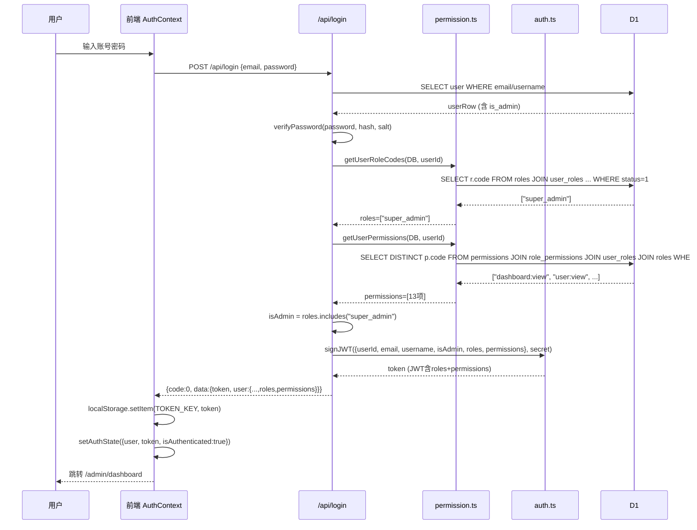
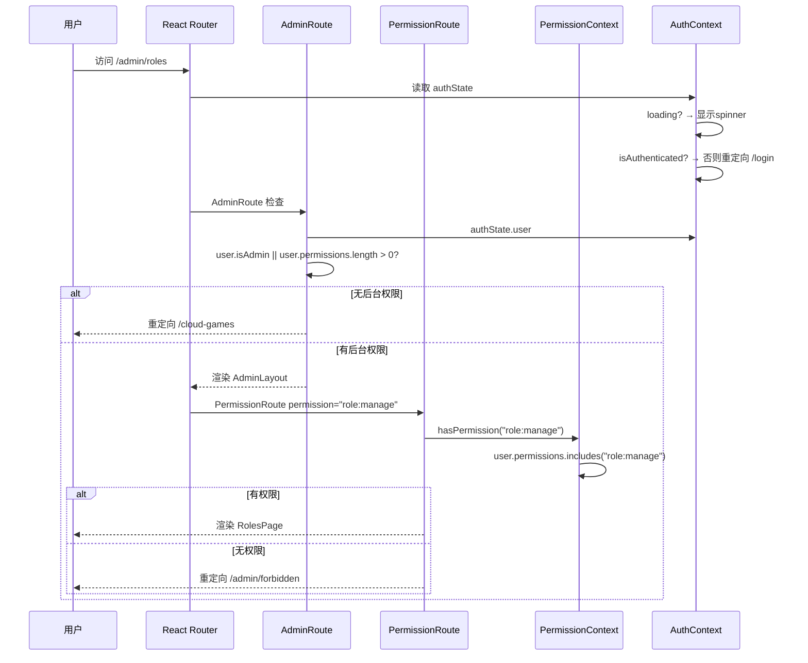
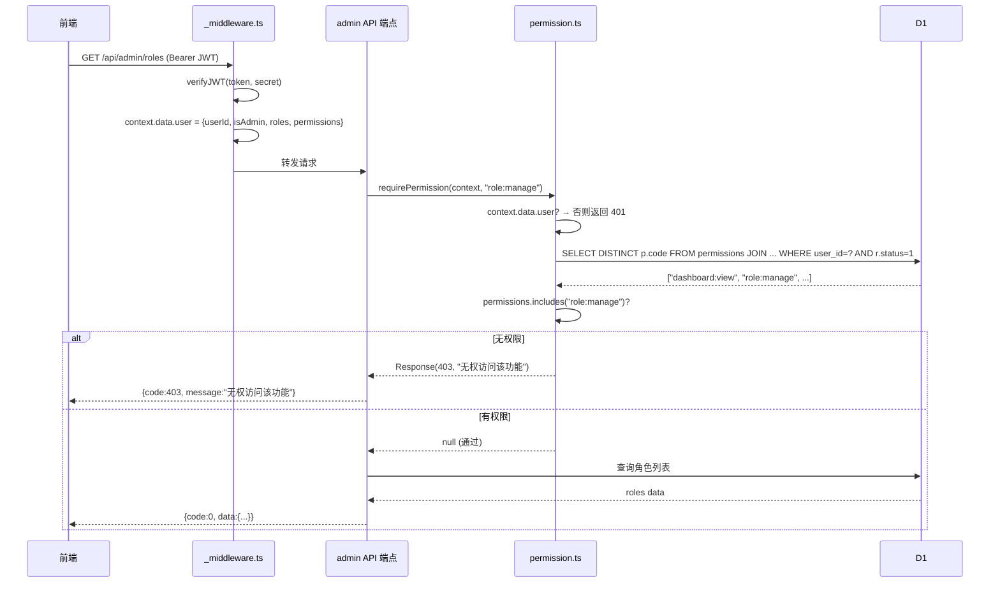
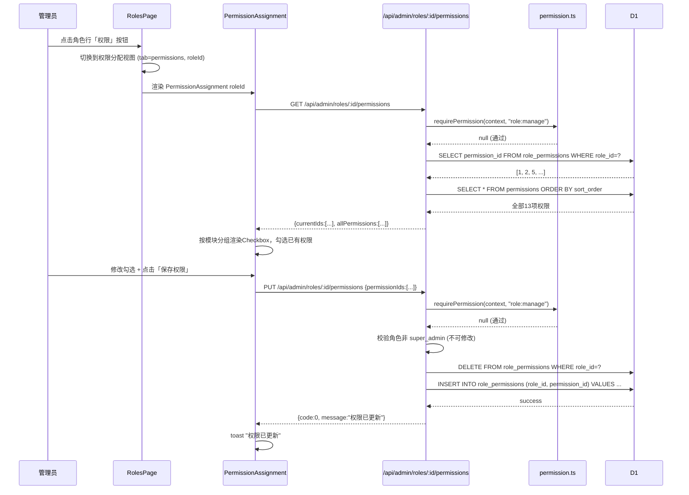
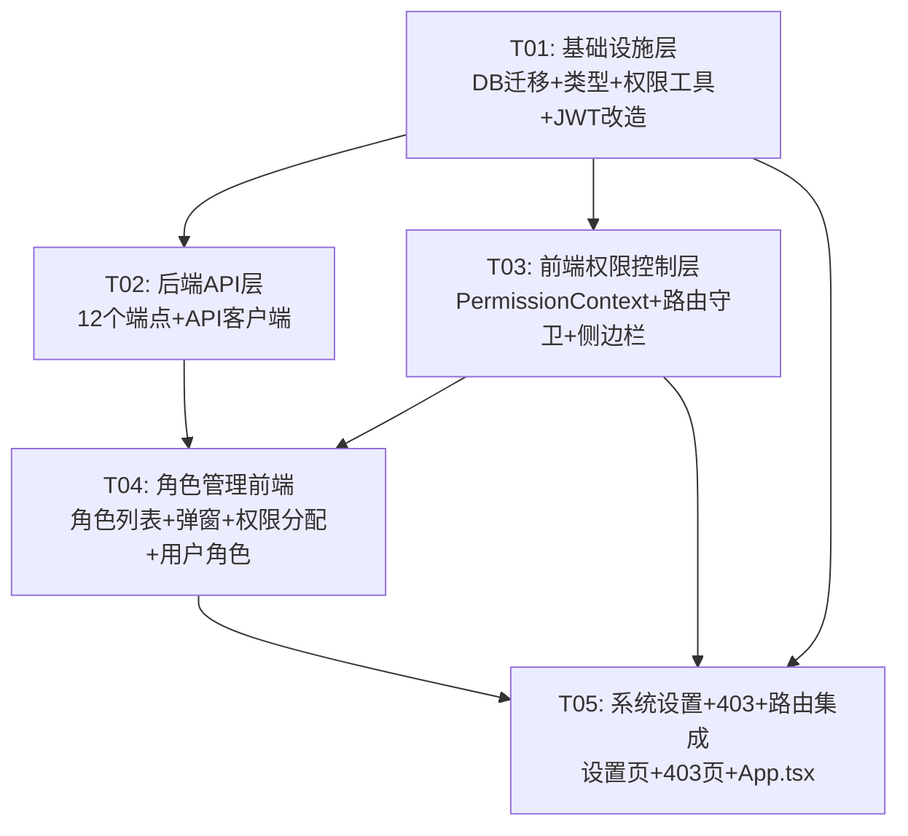

# 系统设计：权限角色（RBAC）+ 系统设置模块

> **项目**: cloudgame-hub 后台管理系统  
> **版本**: V4.0 架构设计  
> **日期**: 2026-07-08  
> **架构师**: 高见远 (Gao)  
> **依据**: PRD-RBAC-Settings.md

---

## 1. 实现方案与框架选型

### 1.1 整体架构思路

在现有 cloudgame-hub 架构上叠加 RBAC 权限层和系统设置层，**不引入任何新框架**，完全复用现有技术栈（Vite + React + TS + Tailwind + Pages Functions + D1）。

**核心设计原则**：
- **后端实时查库**：API 鉴权时不信任 JWT 中的 `permissions`，每次请求实时查询 D1，确保权限变更立即生效
- **前端用 JWT 缓存**：前端路由守卫和菜单过滤使用 JWT 中的 `permissions`，避免每次路由跳转请求后端；权限变更后用户需重新登录刷新 JWT
- **向后兼容**：保留 `is_admin` 字段，有 `super_admin` 角色自动为 `true`
- **零新依赖**：继续用 Tailwind CSS + lucide-react，Pages Functions 原生模式

### 1.2 RBAC 鉴权链路

```
用户登录 → 后端查询角色权限 → 签发JWT(含roles+permissions) → 前端存储JWT
    ↓
前端路由跳转 → AuthContext解析JWT → PermissionContext提供hasPermission()
    ↓
PermissionRoute检查权限 → 通过则渲染页面 / 不通过则重定向403
    ↓
页面内API请求 → 后端middleware解析JWT → 端点调用requirePermission()实时查库
    ↓
D1查询 user_roles→roles→role_permissions→permissions → 通过或返回403
```

### 1.3 后端权限校验中间件

新建 `functions/lib/permission.ts`，导出：

| 函数 | 签名 | 用途 |
|------|------|------|
| `getUserPermissions` | `(db, userId) → Promise<string[]>` | 实时查询用户所有权限码（去重，仅启用角色） |
| `getUserRoleCodes` | `(db, userId) → Promise<string[]>` | 实时查询用户所有角色码（仅启用角色） |
| `hasPermission` | `(db, userId, code) → Promise<boolean>` | 判断用户是否拥有某权限 |
| `requirePermission` | `(context, code) → Promise<Response \| null>` | API端点鉴权：通过返回null，拒绝返回401/403 |

**端点使用模式**（替换原有 `if (!context.data.user?.isAdmin)` 检查）：
```typescript
const denied = await requirePermission(context, 'role:manage');
if (denied) return denied;
// ... 正常业务逻辑
```

### 1.4 前端权限控制

- **PermissionContext** (`src/contexts/PermissionContext.tsx`)：提供 `hasPermission(code)` / `hasAnyPermission(codes)` / `isSuperAdmin`
- **PermissionRoute** (`src/components/PermissionRoute.tsx`)：路由守卫，无权限重定向到 `/admin/forbidden`
- **Sidebar 动态过滤**：NavItem 增加可选 `permission` 字段，渲染时过滤
- **AdminRoute 改造**：从仅检查 `isAdmin` 升级为检查 `permissions.length > 0 || isAdmin`

---

## 2. 文件列表及相对路径

### 新建文件（19个）

| # | 文件路径 | 说明 |
|---|---------|------|
| 1 | `migrations/schema-rbac.sql` | D1迁移脚本：建表+预置数据+用户迁移 |
| 2 | `src/types/rbac.ts` | RBAC+Settings TypeScript类型定义 |
| 3 | `src/constants/permissions.ts` | 权限码常量+模块分组定义 |
| 4 | `functions/lib/permission.ts` | 后端权限校验工具函数 |
| 5 | `functions/api/admin/roles.ts` | GET角色列表 / POST创建角色 |
| 6 | `functions/api/admin/roles/[id].ts` | PUT编辑角色 / DELETE删除角色 |
| 7 | `functions/api/admin/roles/[id]/permissions.ts` | GET/PUT角色权限 |
| 8 | `functions/api/admin/permissions.ts` | GET权限清单 |
| 9 | `functions/api/admin/users/[id]/roles.ts` | GET/PUT用户角色绑定 |
| 10 | `functions/api/admin/settings.ts` | GET设置列表 / PUT批量更新 |
| 11 | `functions/api/admin/settings/[key].ts` | GET单个设置项 |
| 12 | `src/contexts/PermissionContext.tsx` | 权限上下文+usePermission Hook |
| 13 | `src/components/PermissionRoute.tsx` | 权限路由守卫组件 |
| 14 | `src/pages/admin/RolesPage.tsx` | 角色列表+权限分配视图 |
| 15 | `src/pages/admin/SettingsPage.tsx` | 系统设置页(3Tab) |
| 16 | `src/pages/admin/ForbiddenPage.tsx` | 403无权限页 |
| 17 | `src/components/admin/RoleEditModal.tsx` | 角色创建/编辑弹窗 |
| 18 | `src/components/admin/PermissionAssignment.tsx` | 权限分配组件(分组Checkbox) |
| 19 | `src/components/admin/UserRoleModal.tsx` | 用户角色绑定弹窗 |

### 修改文件（14个）

| # | 文件路径 | 修改内容 |
|---|---------|----------|
| 20 | `functions/lib/auth.ts` | signJWT/verifyJWT增加roles[]+permissions[]字段 |
| 21 | `worker-configuration.d.ts` | PageData.user增加roles+permissions字段 |
| 22 | `functions/_middleware.ts` | verifyJWT返回值含roles+permissions，自动注入context.data.user |
| 23 | `functions/api/login.ts` | 登录后查询角色权限，注入JWT |
| 24 | `functions/api/register.ts` | 注册后查询角色权限(新用户为空)，注入JWT |
| 25 | `functions/api/sms-login.ts` | 短信登录后查询角色权限，注入JWT |
| 26 | `functions/api/me.ts` | 返回roles+permissions |
| 27 | `src/types/index.ts` | User类型增加roles+permissions；re-export rbac.ts |
| 28 | `src/contexts/AuthContext.tsx` | DecodedToken增加roles+permissions；User对象携带 |
| 29 | `src/components/AdminRoute.tsx` | 从仅检查isAdmin升级为检查permissions.length>0 |
| 30 | `src/services/api.ts` | 增加RBAC+Settings相关API方法 |
| 31 | `src/components/admin/Sidebar.tsx` | NavItem增加permission字段，动态过滤菜单 |
| 32 | `src/pages/admin/UsersPage.tsx` | 操作列增加「分配角色」按钮，角色列显示角色标签 |
| 33 | `src/App.tsx` | 路由配置：roles/settings/forbidden页面 |

---

## 3. 数据结构与接口

### 3.1 D1 建表 SQL（含预置数据）

> 文件: `migrations/schema-rbac.sql`，可直接在 Cloudflare D1 控制台执行

```sql
-- ═══ 建表 ═══
CREATE TABLE IF NOT EXISTS roles (
  id INTEGER PRIMARY KEY AUTOINCREMENT,
  name TEXT NOT NULL,
  code TEXT UNIQUE NOT NULL,
  description TEXT NOT NULL DEFAULT '',
  is_system INTEGER NOT NULL DEFAULT 0,
  status INTEGER NOT NULL DEFAULT 1,
  created_at TEXT NOT NULL DEFAULT (datetime('now')),
  updated_at TEXT NOT NULL DEFAULT (datetime('now'))
);

CREATE TABLE IF NOT EXISTS permissions (
  id INTEGER PRIMARY KEY AUTOINCREMENT,
  code TEXT UNIQUE NOT NULL,
  name TEXT NOT NULL,
  module TEXT NOT NULL,
  action TEXT NOT NULL,
  sort_order INTEGER NOT NULL DEFAULT 0
);

CREATE TABLE IF NOT EXISTS role_permissions (
  role_id INTEGER NOT NULL,
  permission_id INTEGER NOT NULL,
  PRIMARY KEY (role_id, permission_id),
  FOREIGN KEY (role_id) REFERENCES roles(id) ON DELETE CASCADE,
  FOREIGN KEY (permission_id) REFERENCES permissions(id) ON DELETE CASCADE
);

CREATE TABLE IF NOT EXISTS user_roles (
  user_id INTEGER NOT NULL,
  role_id INTEGER NOT NULL,
  created_at TEXT NOT NULL DEFAULT (datetime('now')),
  PRIMARY KEY (user_id, role_id),
  FOREIGN KEY (user_id) REFERENCES users(id) ON DELETE CASCADE,
  FOREIGN KEY (role_id) REFERENCES roles(id) ON DELETE CASCADE
);

CREATE TABLE IF NOT EXISTS settings (
  key TEXT PRIMARY KEY,
  value TEXT NOT NULL DEFAULT '',
  "group" TEXT NOT NULL DEFAULT 'basic',
  updated_at TEXT NOT NULL DEFAULT (datetime('now'))
);

-- ═══ 索引 ═══
CREATE INDEX IF NOT EXISTS idx_user_roles_user ON user_roles(user_id);
CREATE INDEX IF NOT EXISTS idx_user_roles_role ON user_roles(role_id);
CREATE INDEX IF NOT EXISTS idx_role_permissions_role ON role_permissions(role_id);
CREATE INDEX IF NOT EXISTS idx_settings_group ON settings("group");

-- ═══ 预置角色 ═══
INSERT INTO roles (name, code, description, is_system, status) VALUES
  ('超级管理员', 'super_admin', '拥有系统全部权限，不可删除或禁用', 1, 1),
  ('运营人员', 'operator', '负责日常内容运营，可管理薅羊毛和查看所有数据', 1, 1);

-- ═══ 预置权限(13项) ═══
INSERT INTO permissions (code, name, module, action, sort_order) VALUES
  ('dashboard:view','查看仪表盘','dashboard','view',1),
  ('user:view','查看用户','user','view',2),
  ('user:manage','管理用户','user','manage',3),
  ('platform:view','查看云游戏平台','platform','view',4),
  ('platform:manage','管理云游戏平台','platform','manage',5),
  ('desktop:view','查看办公云电脑','desktop','view',6),
  ('desktop:manage','管理办公云电脑','desktop','manage',7),
  ('deal:view','查看薅羊毛','deal','view',8),
  ('deal:manage','管理薅羊毛','deal','manage',9),
  ('game:view','查看游戏库','game','view',10),
  ('game:manage','管理游戏库','game','manage',11),
  ('role:manage','管理权限角色','role','manage',12),
  ('settings:manage','管理系统设置','settings','manage',13);

-- 超级管理员=全部权限
INSERT INTO role_permissions (role_id, permission_id)
  SELECT r.id, p.id FROM roles r, permissions p WHERE r.code = 'super_admin';

-- 运营人员=全部:view + deal:manage
INSERT INTO role_permissions (role_id, permission_id)
  SELECT r.id, p.id FROM roles r, permissions p
  WHERE r.code = 'operator' AND p.code IN (
    'dashboard:view','user:view','platform:view','desktop:view',
    'deal:view','deal:manage','game:view'
  );

-- ═══ 预置系统设置 ═══
INSERT INTO settings (key, value, "group") VALUES
  ('site_name','云游戏中心','basic'),
  ('logo_url','','basic'),
  ('icp_number','','basic'),
  ('contact_email','','basic'),
  ('contact_qq','','basic'),
  ('contact_wechat','','basic'),
  ('site_description','云游戏/云电脑入口聚合平台','basic'),
  ('password_min_length','8','params'),
  ('password_max_attempts','5','params'),
  ('verification_code_ttl','10','params'),
  ('verification_code_interval','60','params'),
  ('registration_enabled','true','params'),
  ('operation_log_enabled','true','logging'),
  ('login_log_enabled','true','logging'),
  ('log_retention_days','30','logging');

-- ═══ 迁移：现有 is_admin=1 用户绑定 super_admin ═══
INSERT INTO user_roles (user_id, role_id)
  SELECT u.id, r.id FROM users u, roles r
  WHERE u.is_admin = 1 AND r.code = 'super_admin'
  AND NOT EXISTS (
    SELECT 1 FROM user_roles ur WHERE ur.user_id = u.id AND ur.role_id = r.id
  );
```

### 3.2 TypeScript 类型定义

> 文件: `src/types/rbac.ts`

```typescript
/** 权限码联合类型（13种）。 */
export type PermissionCode =
  | "dashboard:view" | "user:view" | "user:manage"
  | "platform:view" | "platform:manage"
  | "desktop:view" | "desktop:manage"
  | "deal:view" | "deal:manage"
  | "game:view" | "game:manage"
  | "role:manage" | "settings:manage";

/** 权限项（对应 permissions 表）。 */
export interface Permission {
  id: number;
  code: string;
  name: string;
  module: string;
  action: string;
  sortOrder: number;
}

/** 按模块分组的权限（用于权限分配视图）。 */
export interface PermissionGroup {
  module: string;
  moduleLabel: string;
  permissions: Permission[];
}

/** 角色（对应 roles 表）。 */
export interface Role {
  id: number;
  name: string;
  code: string;
  description: string;
  isSystem: boolean;
  status: number; // 1=启用 0=禁用
  createdAt: string;
  updatedAt: string;
}

/** 角色列表项（含绑定用户数和权限数）。 */
export interface RoleListItem extends Role {
  userCount: number;
  permissionCount: number;
}

/** 创建角色请求体。 */
export interface CreateRoleRequest {
  name: string;
  code: string;
  description?: string;
  status?: number;
}

/** 更新角色请求体（code 不可改）。 */
export interface UpdateRoleRequest {
  name?: string;
  description?: string;
  status?: number;
}

/** 更新角色权限请求体（全量覆盖）。 */
export interface UpdateRolePermissionsRequest {
  permissionIds: number[];
}

/** 简化角色信息（用户角色绑定弹窗用）。 */
export interface RoleOption {
  id: number;
  name: string;
  code: string;
  status: number;
}

/** 更新用户角色请求体（全量覆盖）。 */
export interface UpdateUserRolesRequest {
  roleIds: number[];
}

/** 系统设置项（对应 settings 表）。 */
export interface SettingItem {
  key: string;
  value: string;
  group: string;
  updatedAt: string;
}

/** 按分组返回的设置（GET /api/admin/settings 响应）。 */
export type SettingsByGroup = Record<string, SettingItem[]>;

/** 批量更新设置请求体。 */
export interface UpdateSettingsRequest {
  settings: Record<string, string>; // { key: value, ... }
}
```

> 文件: `src/types/index.ts`（修改部分）

```typescript
// User 类型增加 roles 和 permissions 字段
export interface User {
  id: number;
  email: string;
  username: string;
  isAdmin: boolean;
  roles: string[];        // 新增
  permissions: string[];  // 新增
  createdAt: string;
  phone?: string;
}

// 末尾增加 re-export
export * from "./rbac";
```

### 3.3 权限常量定义

> 文件: `src/constants/permissions.ts`

```typescript
import type { PermissionGroup } from "../types/rbac";

/** 全部权限码（与 D1 permissions 表一致）。 */
export const ALL_PERMISSION_CODES = [
  "dashboard:view", "user:view", "user:manage",
  "platform:view", "platform:manage",
  "desktop:view", "desktop:manage",
  "deal:view", "deal:manage",
  "game:view", "game:manage",
  "role:manage", "settings:manage",
] as const;

/** 权限按模块分组（用于权限分配视图渲染）。 */
export const PERMISSION_GROUPS: { module: string; moduleLabel: string; permissions: { code: string; name: string }[] }[] = [
  {
    module: "dashboard",
    moduleLabel: "仪表盘",
    permissions: [{ code: "dashboard:view", name: "查看仪表盘" }],
  },
  {
    module: "user",
    moduleLabel: "用户管理",
    permissions: [
      { code: "user:view", name: "查看用户" },
      { code: "user:manage", name: "管理用户" },
    ],
  },
  {
    module: "platform",
    moduleLabel: "云游戏平台",
    permissions: [
      { code: "platform:view", name: "查看平台" },
      { code: "platform:manage", name: "管理平台" },
    ],
  },
  {
    module: "desktop",
    moduleLabel: "办公云电脑",
    permissions: [
      { code: "desktop:view", name: "查看云电脑" },
      { code: "desktop:manage", name: "管理云电脑" },
    ],
  },
  {
    module: "deal",
    moduleLabel: "薅羊毛",
    permissions: [
      { code: "deal:view", name: "查看薅羊毛" },
      { code: "deal:manage", name: "管理薅羊毛" },
    ],
  },
  {
    module: "game",
    moduleLabel: "游戏库",
    permissions: [
      { code: "game:view", name: "查看游戏" },
      { code: "game:manage", name: "管理游戏" },
    ],
  },
  {
    module: "role",
    moduleLabel: "系统管理",
    permissions: [{ code: "role:manage", name: "管理权限角色" }],
  },
  {
    module: "settings",
    moduleLabel: "系统管理",
    permissions: [{ code: "settings:manage", name: "管理系统设置" }],
  },
];

/** 侧边栏菜单项与权限码映射。 */
export const NAV_PERMISSIONS: Record<string, string> = {
  "/admin/dashboard": "dashboard:view",
  "/admin/users": "user:view",
  "/admin/content/platforms": "platform:view",
  "/admin/content/desktops": "desktop:view",
  "/admin/content/deals": "deal:view",
  "/admin/content/games": "game:view",
  "/admin/roles": "role:manage",
  "/admin/settings": "settings:manage",
};
```

### 3.4 类图

```mermaid
classDiagram
    class Role {
        +id: number
        +name: string
        +code: string
        +description: string
        +isSystem: boolean
        +status: number
        +createdAt: string
        +updatedAt: string
    }

    class Permission {
        +id: number
        +code: string
        +name: string
        +module: string
        +action: string
        +sortOrder: number
    }

    class RolePermission {
        +roleId: number
        +permissionId: number
    }

    class UserRole {
        +userId: number
        +roleId: number
        +createdAt: string
    }

    class Setting {
        +key: string
        +value: string
        +group: string
        +updatedAt: string
    }

    class User {
        +id: number
        +email: string
        +username: string
        +isAdmin: boolean
        +roles: string[]
        +permissions: string[]
        +createdAt: string
    }

    class PermissionLib {
        <<functions/lib/permission.ts>>
        +getUserPermissions(db, userId) string[]
        +getUserRoleCodes(db, userId) string[]
        +hasPermission(db, userId, code) boolean
        +requirePermission(context, code) Response~null~
    }

    class AuthLib {
        <<functions/lib/auth.ts>>
        +signJWT(payload, secret) string
        +verifyJWT(token, secret) JWTPayload
    }

    class PermissionContext {
        <<React Context>>
        +permissions: string[]
        +roles: string[]
        +hasPermission(code) boolean
        +hasAnyPermission(codes) boolean
        +isSuperAdmin: boolean
    }

    class ApiClient {
        <<services/api.ts>>
        +getAdminRoles() RoleListItem[]
        +createRole(data) Role
        +updateRole(id, data) Role
        +deleteRole(id) void
        +getRolePermissions(id) Permission[]
        +updateRolePermissions(id, ids) void
        +getPermissions() Permission[]
        +getUserRoles(id) RoleOption[]
        +updateUserRoles(id, ids) void
        +getSettings(group?) SettingsByGroup
        +getSetting(key) SettingItem
        +updateSettings(data) void
    }

    Role ||--o{ RolePermission : "role_permissions"
    Permission ||--o{ RolePermission : "role_permissions"
    User ||--o{ UserRole : "user_roles"
    Role ||--o{ UserRole : "user_roles"
    User --> PermissionContext : "permissions from JWT"
    PermissionLib --> AuthLib : "queries for JWT signing"
    ApiClient --> Role : "CRUD"
    ApiClient --> Permission : "list"
    ApiClient --> Setting : "read/write"
```

---

## 4. 程序调用流程

### 4.1 登录流程（含角色权限注入 JWT）



### 4.2 前端路由守卫流程



### 4.3 后端 API 权限校验流程



### 4.4 角色权限分配流程



---

## 5. 任务列表

### T01: 基础设施层 — DB迁移 + 类型定义 + 权限常量 + 后端权限工具 + JWT/中间件/登录流程改造

**涉及文件（12个）**：
- `migrations/schema-rbac.sql` [新建]
- `src/types/rbac.ts` [新建]
- `src/constants/permissions.ts` [新建]
- `functions/lib/permission.ts` [新建]
- `functions/lib/auth.ts` [修改] — signJWT/verifyJWT 增加 roles+permissions
- `worker-configuration.d.ts` [修改] — PageData.user 增加 roles+permissions
- `functions/_middleware.ts` [修改] — 自动传递 roles+permissions
- `functions/api/login.ts` [修改] — 查询角色权限注入JWT
- `functions/api/register.ts` [修改] — 查询角色权限注入JWT
- `functions/api/sms-login.ts` [修改] — 查询角色权限注入JWT
- `functions/api/me.ts` [修改] — 返回 roles+permissions
- `src/types/index.ts` [修改] — User 增加 roles+permissions，re-export rbac.ts

**依赖**: 无  
**优先级**: P0  
**描述**: 这是整个功能的地基。先建表+灌预置数据，定义 TS 类型和权限常量，然后实现后端权限查询工具。接着改造 JWT 签发/验证流程（payload 增加 roles+permissions），改造中间件传递新字段，改造三个登录端点（login/register/sms-login）在签发 JWT 前查询用户角色权限，最后改造 me.ts 返回新字段。

**关键实现点**：
1. `permission.ts` 的 `getUserPermissions` 查询 SQL：
   ```sql
   SELECT DISTINCT p.code FROM permissions p
   JOIN role_permissions rp ON rp.permission_id = p.id
   JOIN user_roles ur ON ur.role_id = rp.role_id
   JOIN roles r ON r.id = ur.role_id
   WHERE ur.user_id = ? AND r.status = 1
   ```
2. `signJWT` 的 payload 类型扩展为 `{ userId, email, username, isAdmin, roles: string[], permissions: string[] }`
3. 三个登录端点改造模式统一：认证成功后调用 `getUserRoleCodes` + `getUserPermissions`，`isAdmin = roles.includes('super_admin')`
4. `_middleware.ts` 无需改动逻辑——`verifyJWT` 返回值增加字段后，`context.data.user = user` 自动携带

---

### T02: 后端API层 — 全部API端点 + 前端API客户端扩展

**涉及文件（8个）**：
- `functions/api/admin/roles.ts` [新建] — GET角色列表(含userCount/permissionCount) + POST创建角色
- `functions/api/admin/roles/[id].ts` [新建] — PUT编辑角色(code不可改,is_system不可禁用) + DELETE删除角色(有绑定用户拒绝)
- `functions/api/admin/roles/[id]/permissions.ts` [新建] — GET角色权限 + PUT全量覆盖更新
- `functions/api/admin/permissions.ts` [新建] — GET全部权限清单(按sort_order)
- `functions/api/admin/users/[id]/roles.ts` [新建] — GET用户角色 + PUT全量覆盖更新
- `functions/api/admin/settings.ts` [新建] — GET设置(支持?group过滤) + PUT批量更新
- `functions/api/admin/settings/[key].ts` [新建] — GET单个设置项
- `src/services/api.ts` [修改] — ApiClient 增加 RBAC+Settings 方法

**依赖**: T01  
**优先级**: P0  
**描述**: 实现全部 12 个 API 端点。所有 admin 端点统一使用 `requirePermission(context, 'xxx:yyy')` 替代原有的 `isAdmin` 检查。同时在前端 ApiClient 中增加对应的调用方法。

**关键实现点**：
1. GET `/api/admin/roles` 返回每角色的 userCount（子查询 COUNT user_roles）和 permissionCount（子查询 COUNT role_permissions）
2. 创建角色时校验 code 格式 `/^[a-z_]+$/`，code 唯一性
3. 编辑角色时 code 字段忽略（不可改），is_system=1 的角色 status 不可改为 0
4. 删除角色时先查 user_roles 是否有绑定，有则返回 409
5. PUT 角色权限为全量覆盖：先 DELETE 再 INSERT（事务）
6. super_admin 角色的权限不可修改（PUT 端点拒绝）
7. GET `/api/admin/users/:id/roles` 需要 `user:view` 权限，PUT 需要 `user:manage` 权限
8. GET `/api/admin/settings` 支持 `?group=basic|params|logging` 过滤，不传则返回全部分组
9. PUT `/api/admin/settings` 接收 `{ settings: { key: value, ... } }`，逐条 UPSERT
10. ApiClient 新增方法：`getAdminRoles`, `createRole`, `updateRole`, `deleteRole`, `getRolePermissions`, `updateRolePermissions`, `getPermissions`, `getUserRoles`, `updateUserRoles`, `getSettings`, `getSetting`, `updateSettings`

---

### T03: 前端权限控制层 — PermissionContext + 路由守卫 + AuthContext改造 + 侧边栏动态过滤

**涉及文件（5个）**：
- `src/contexts/PermissionContext.tsx` [新建] — 权限上下文，提供 hasPermission 等
- `src/components/PermissionRoute.tsx` [新建] — 权限路由守卫
- `src/components/AdminRoute.tsx` [修改] — 升级为检查 permissions.length > 0
- `src/contexts/AuthContext.tsx` [修改] — DecodedToken 增加 roles+permissions，User 对象携带
- `src/components/admin/Sidebar.tsx` [修改] — NavItem 增加 permission 字段，动态过滤

**依赖**: T01  
**优先级**: P0  
**描述**: 构建前端权限控制基础设施。AuthContext 解析 JWT 中的 roles+permissions 并存入 user 对象。PermissionContext 从 AuthContext 读取权限数据，提供 hasPermission 等 Hook。PermissionRoute 组件包裹具体页面路由，无权限重定向到 403。AdminRoute 从仅检查 isAdmin 升级为检查是否有任意后台权限。Sidebar 根据 NAV_PERMISSIONS 映射动态过滤菜单项。

**关键实现点**：
1. `AuthContext.tsx` 的 `DecodedToken` 接口增加 `roles: string[]` 和 `permissions: string[]`
2. `decodeToken` 函数解析 JWT payload 中的 roles 和 permissions
3. `PermissionContext` 从 `useAuthContext()` 获取 `authState.user`，提取 permissions 和 roles
4. `hasPermission(code)` = `permissions.includes(code)`
5. `isSuperAdmin` = `roles.includes('super_admin')`
6. `PermissionRoute` 无权限时 `<Navigate to="/admin/forbidden" replace />`
7. `AdminRoute` 改为：`authState.user?.isAdmin || (authState.user?.permissions?.length ?? 0) > 0`
8. `Sidebar` 中 `mainNav`, `contentNav`, `secondaryNav` 每项增加 `permission` 字段，渲染时 `usePermission()` 过滤

---

### T04: 角色管理前端 — 角色列表 + 编辑弹窗 + 权限分配 + 用户角色绑定

**涉及文件（5个）**：
- `src/pages/admin/RolesPage.tsx` [新建] — 角色列表表格 + 新建/编辑/删除/权限分配入口
- `src/components/admin/RoleEditModal.tsx` [新建] — 角色创建/编辑弹窗
- `src/components/admin/PermissionAssignment.tsx` [新建] — 分组Checkbox + 全选/反选
- `src/components/admin/UserRoleModal.tsx` [新建] — 用户角色绑定弹窗
- `src/pages/admin/UsersPage.tsx` [修改] — 操作列增加「分配角色」按钮，角色列显示角色标签

**依赖**: T01, T02, T03  
**优先级**: P0  
**描述**: 实现角色管理完整前端。RolesPage 包含角色列表表格（ID/名称/标识/描述/用户数/状态/操作）和权限分配视图（通过 tab 切换）。RoleEditModal 处理创建/编辑表单。PermissionAssignment 按模块分组渲染 Checkbox，支持全选/反选。UserRoleModal 在用户管理页弹出，多选角色绑定。UsersPage 操作列增加「分配角色」按钮，角色列从 isAdmin 标签改为显示角色 Tag。

**关键实现点**：
1. RolesPage 两种视图模式：默认列表视图 + 权限分配视图（URL 参数 `?tab=permissions&roleId=X`）
2. 角色列表操作列：超级管理员行只显示「编辑」，不显示「权限」「删除」
3. RoleEditModal：创建时 code 可编辑（仅 `[a-z_]+`，自动转小写），编辑时 code 灰显
4. PermissionAssignment：使用 `PERMISSION_GROUPS` 常量分组渲染，super_admin 为只读全选
5. UserRoleModal：展示所有启用状态角色，多选 Checkbox，底部提示权限取并集
6. UsersPage 修改：角色列调用 `getUserRoles` 获取角色标签（多角色彩色 Tag），操作列增加「分配角色」按钮（需 `user:manage` 权限才显示）

---

### T05: 系统设置 + 403页 + 路由集成

**涉及文件（3个）**：
- `src/pages/admin/SettingsPage.tsx` [新建] — 系统设置页，3个Tab（基础配置/参数管理/日志设置）
- `src/pages/admin/ForbiddenPage.tsx` [新建] — 403无权限页（锁图标+描述+返回按钮）
- `src/App.tsx` [修改] — 路由配置：roles/settings/forbidden，用 PermissionRoute 包裹各页面

**依赖**: T01, T03, T04  
**优先级**: P0  
**描述**: 实现系统设置页面（3 Tab 表单）和 403 无权限页面，完成路由集成。App.tsx 中将 PlaceholderPage 替换为实际页面，使用 PermissionRoute 按权限包裹每个 admin 子路由。

**关键实现点**：
1. SettingsPage 使用 Tab 切换：basic / params / logging，URL hash 同步
2. 基础配置 Tab：网站名称、Logo URL、备案号、联系邮箱、客服QQ/微信、网站描述
3. 参数管理 Tab：密码最小长度、最大尝试次数、验证码有效期、发送间隔、注册开关（Toggle）
4. 日志设置 Tab：操作日志开关、登录日志开关、日志保留天数
5. 保存逻辑：收集当前 Tab 表单数据，调用 `apiClient.updateSettings({ settings: {...} })`
6. ForbiddenPage：居中布局，锁图标(lucide Lock)，「403 - 无权访问」标题，描述文字，「返回仪表盘」+「返回前台」按钮
7. App.tsx 路由改造：将 PlaceholderPage 替换为 RolesPage/SettingsPage，新增 forbidden 路由，用 PermissionRoute 包裹各 admin 子路由

---

### 任务依赖图



---

## 6. 依赖包列表

**无需新增任何 npm 依赖。** 本次增量完全复用现有技术栈：

| 已有依赖 | 用途 |
|---------|------|
| `react@^18.3.1` | UI框架 |
| `react-router-dom@^6.26.0` | 路由（使用现有 Navigate/Route/Outlet） |
| `lucide-react@^0.460.0` | 图标（Lock, ShieldCheck, Settings 等已有） |
| `tailwindcss@^3.4.14` | 样式 |

后端零依赖，继续使用 Web Crypto API（JWT签名）+ D1 binding（数据库查询）。

---

## 7. 共享知识（跨文件约定）

### 7.1 权限码命名规范

- 格式：`模块:操作`，全小写，如 `user:manage`
- 操作仅两种：`view`（只读）和 `manage`（增删改）
- 权限码在 D1 `permissions` 表和前端 `src/constants/permissions.ts` 中必须完全一致
- 新增权限需同时更新：D1 迁移SQL + 前端常量 + `NAV_PERMISSIONS` 映射

### 7.2 API 路径规范

- 管理后台 API 统一前缀 `/api/admin/`
- 角色 CRUD: `/api/admin/roles` 和 `/api/admin/roles/:id`
- 角色权限: `/api/admin/roles/:id/permissions`
- 用户角色: `/api/admin/users/:id/roles`
- 系统设置: `/api/admin/settings` 和 `/api/admin/settings/:key`
- 所有响应统一信封: `{ code: number, data: T | null, message: string }`，`code === 0` 为成功
- 鉴权失败: 401（未登录）或 403（无权限）

### 7.3 后端鉴权统一模式

所有 admin API 端点**必须**在处理逻辑前调用：
```typescript
const denied = await requirePermission(context, '模块:操作');
if (denied) return denied;
```
- `requirePermission` 实时查 D1（不信任 JWT 中的 permissions）
- 超级管理员角色自动通过所有校验（因其拥有全部权限）
- `requirePermission` 已处理未登录（401）和无权限（403）两种情况

### 7.4 前端权限控制规范

- **路由级**: 用 `<PermissionRoute permission="xxx:yyy">` 包裹页面组件
- **菜单级**: Sidebar NavItem 设置 `permission` 字段，自动过滤
- **按钮级**: 使用 `usePermission()` 的 `hasPermission()` 条件渲染
- **权限数据来源**: JWT payload 中的 `permissions` 数组（非实时查询，变更需重新登录）

### 7.5 D1 查询封装方式

- 继续使用原生 `DB.prepare(sql).bind(...).first()` / `.all()` / `.run()` 模式
- 不引入 ORM 或查询构建器
- 错误处理: `try { ... } catch { return serverError("数据库查询失败"); }`
- 分页: `LIMIT ? OFFSET ?`，参数绑定

### 7.6 全量覆盖更新模式

角色权限和用户角色的 PUT 接口采用**全量覆盖**模式：
1. 先 `DELETE FROM xxx WHERE ...`
2. 再 `INSERT INTO xxx ...` 批量插入
3. 使用 `DB.batch([stmt1, stmt2, ...])` 确保原子性（D1 batch 在单个隐式事务中执行）

### 7.7 组件 Props 传递规范

- 弹窗组件统一 Props: `{ open: boolean, onClose: () => void, onSaved?: () => void }`
- 列表页数据获取: `useEffect` + `useCallback` + `apiClient.xxx()`，与现有 UsersPage 模式一致
- 加载状态: `loading: boolean` + `error: string`，与现有模式一致

### 7.8 is_admin 向后兼容策略

- `users` 表保留 `is_admin` 字段，不删除
- 登录时 `isAdmin = roles.includes('super_admin')`，同步更新 `users.is_admin`（保持一致性）
- `AdminRoute` 优先检查 `permissions.length > 0`，兼容 `isAdmin === true`
- 现有 `context.data.user?.isAdmin` 检查在非 RBAC 端点中继续可用

---

## 8. 待明确事项

| # | 问题 | 架构师建议 | 影响 |
|---|------|-----------|------|
| A1 | 禁用角色后，已登录该角色用户的 JWT 中 permissions 仍含旧权限，前端路由守卫不会立即收缩 | 后端 API 实时查库可防止越权操作；前端路由守卫使用 JWT 缓存权限，用户需重新登录后才收缩菜单。可接受——安全由后端保障，前端仅影响 UX | 前端 UX |
| A2 | `users.is_admin` 字段是否需要在角色变更时同步更新 | 建议在 PUT /api/admin/users/:id/roles 时同步更新 is_admin（有 super_admin 角色则 is_admin=1，否则=0），保持一致性 | 数据一致性 |
| A3 | 系统设置页保存后是否需要刷新当前 JWT | 系统设置与 JWT 无关，无需刷新。仅角色/权限变更影响 JWT，且后端实时查库保障安全 | 无 |
| A4 | D1 batch 操作是否支持事务回滚 | Cloudflare D1 的 `DB.batch()` 在单个隐式事务中执行，全部成功或全部回滚。角色权限全量覆盖使用 batch 安全 | 数据完整性 |
| A5 | 前台是否需要读取 settings 表 | P0 仅后台配置。前台读取为 P1，届时在 Header/Footer 组件调用公开 API `/api/settings`（无需鉴权）读取基础配置 | P1 范围 |
| A6 | 迁移 SQL 重复执行安全性 | 所有建表使用 `IF NOT EXISTS`。预置数据 INSERT 如需重复执行，应改为 `INSERT OR IGNORE`。首次执行无需改动 | 运维操作 |
| A7 | 现有 admin 端点是否本次改造 | 本次 5 个任务仅新建 RBAC+Settings 端点。现有端点（dashboard/users/platforms/desktops/deals/games）的 `isAdmin → requirePermission` 改造建议工程师在 T02 完成后顺手做（每个文件仅改1-2行），确保非超管角色可用后台 | 兼容性 |

---

## 附录：API 端点权限映射速查表

### 新增端点

| 端点 | 方法 | 所需权限 | 说明 |
|------|------|----------|------|
| `/api/admin/roles` | GET | `role:manage` | 角色列表(含userCount/permissionCount) |
| `/api/admin/roles` | POST | `role:manage` | 创建角色 |
| `/api/admin/roles/:id` | PUT | `role:manage` | 编辑角色(code不可改) |
| `/api/admin/roles/:id` | DELETE | `role:manage` | 删除角色(有绑定用户拒绝) |
| `/api/admin/roles/:id/permissions` | GET | `role:manage` | 获取角色权限 |
| `/api/admin/roles/:id/permissions` | PUT | `role:manage` | 更新角色权限(全量覆盖) |
| `/api/admin/permissions` | GET | `role:manage` | 全部权限清单 |
| `/api/admin/users/:id/roles` | GET | `user:view` | 获取用户角色 |
| `/api/admin/users/:id/roles` | PUT | `user:manage` | 更新用户角色(全量覆盖) |
| `/api/admin/settings` | GET | `settings:manage` | 获取设置(支持?group过滤) |
| `/api/admin/settings/:key` | GET | `settings:manage` | 获取单个设置项 |
| `/api/admin/settings` | PUT | `settings:manage` | 批量更新设置 |

### 现有端点改造建议（T02完成后顺手改）

| 端点 | 原检查 | 新所需权限 |
|------|--------|----------|
| `/api/admin/dashboard` | `isAdmin` | `dashboard:view` |
| `/api/admin/users` GET | `isAdmin` | `user:view` |
| `/api/admin/users/:id` PUT/DELETE | `isAdmin` | `user:manage` |
| `/api/admin/platforms` GET | `isAdmin` | `platform:view` |
| `/api/admin/platforms/:id` POST/PUT/DELETE | `isAdmin` | `platform:manage` |
| `/api/admin/desktops` 同理 | `isAdmin` | `desktop:view` / `desktop:manage` |
| `/api/admin/deals` 同理 | `isAdmin` | `deal:view` / `deal:manage` |
| `/api/admin/games` 同理 | `isAdmin` | `game:view` / `game:manage` |

> 现有端点改造不在本次 5 个任务硬性范围内，但建议工程师在 T02 完成后一并改造（每个文件仅改1行 `isAdmin → requirePermission`），确保非超级管理员的角色也能正常使用后台功能。super_admin 因拥有全部权限，改造前后行为一致。