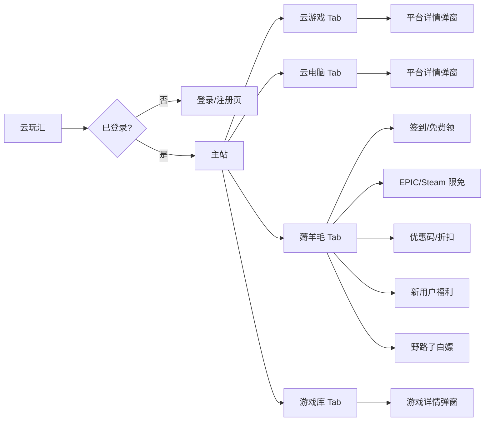

# PRD — 云玩汇 2.0：云游戏 × 云电脑 × 薅羊毛聚合站

> **版本**：v2.0 | **日期**：2025-07-06 | **作者**：产品经理 许清楚（Xu）

---

## 一、项目信息

| 项目 | 内容 |
|------|------|
| **项目名称** | `cloudgame-hub` |
| **技术栈** | Vite + React + TypeScript + Tailwind CSS |
| **后端方案** | Cloudflare Pages（静态托管）+ Workers（API）+ D1（SQLite 数据库） |
| **部署域名** | 用户自有域名（通过 Cloudflare 绑定） |
| **原始需求复述** | 将现有云游戏导航站升级为独立上线网站，新增账号系统、扩充云游戏平台至 ≥10 个、新增办公云电脑模块（≥5 个）、新增薅羊毛聚合模块（5 大类），全站使用 Cloudflare 全家桶免费部署 |

### 现有基线

- 6 个云游戏平台入口（网易云游戏、腾讯START、顺网云、达龙云、ToDesk、海马云）
- 29 款游戏数据（含类型/评分/配置要求/平台支持/标签）
- 平台卡片展示、搜索、筛选（类型/平台/配置）、游戏详情弹窗
- 无账号系统、无后端

---

## 二、产品目标

**产品定位**：一站式云游戏/云电脑发现与薅羊毛导航站——帮用户找到最便宜的云端玩游戏和办公方案，零成本试玩、精准直达。

### 核心目标

1. **门控访问**：通过账号密码系统实现内容访问控制，仅注册用户可查看站点内容，用户数据自主掌控（Cloudflare D1）
2. **全平台覆盖**：云游戏平台 ≥10 个 + 办公云电脑 ≥5 个，每个入口提供官网直达、价格/免费额度/活动信息
3. **薅羊毛聚合**：集中展示各平台签到/限免/优惠码/新用户福利/野路子白嫖渠道，让用户用最低成本体验云服务

---

## 三、用户故事

| # | 角色 | 故事 |
|---|------|------|
| US-1 | 新访客 | 作为一个想白嫖云游戏的新访客，我想注册一个账号，这样就能查看所有平台的免费时长领取入口和薅羊毛攻略 |
| US-2 | 低配电脑玩家 | 作为一个没有高配显卡的玩家，我想在一个页面对比所有云游戏平台的价格和免费额度，这样我能选到最便宜的方案玩 3A 大作 |
| US-3 | 远程办公者 | 作为一个需要远程办公的用户，我想找到适合办公的云电脑平台，这样我不买新电脑也能处理文档和设计工作 |
| US-4 | 羊毛党 | 作为一个羊毛党，我想看到 EPIC/Steam 限免信息和各平台优惠码汇总，这样我不会错过任何免费游戏和折扣 |
| US-5 | 站长（小韩） | 作为站长，我想用自己的域名部署网站且不花服务器钱，这样我能完全掌控用户数据和站点内容 |

---

## 四、需求池

### P0 — 必须有（MVP 上线阻断项）

| ID | 需求 | 描述 | 验收标准 |
|----|------|------|----------|
| P0-1 | 用户注册 | 用户可通过用户名 + 密码注册账号；密码使用 bcrypt/Argon2 加盐哈希存储于 D1 | ① 注册接口 `POST /api/register` 返回 JWT token ② 密码在 D1 中以哈希形式存储，不可逆 ③ 重复用户名注册返回 409 ④ 密码长度 ≥6 位 |
| P0-2 | 用户登录 | 已注册用户通过用户名 + 密码登录获取 session token | ① 登录接口 `POST /api/login` 校验密码后返回 JWT ② Token 有效期 ≥7 天 ③ 密码错误返回 401 |
| P0-3 | 访问门控 | 未登录用户访问任意页面均被重定向到登录/注册页；已登录用户可正常浏览全站 | ① 未携带有效 token 的请求被拦截 ② 前端路由守卫拦截未认证访问 ③ Workers API 对所有数据接口校验 token |
| P0-4 | 云游戏平台扩充至 ≥10 | 在现有 6 个平台基础上补充至 ≥10 个，新增平台包括但不限于：格来云游戏、菜鸡云游戏、红手指云手机、蘑菇云游戏、网易云游戏手机版、虎牙云游戏 | ① 平台总数 ≥10 ② 每个平台含：名称、官网链接、简介、特点标签、价格、免费额度/活动信息 ③ 数据写入 `platforms.ts` 或 D1 |
| P0-5 | 办公云电脑模块 | 新增「办公云电脑」板块，收录 ≥5 个办公云电脑平台（阿里云无影、青椒云电脑、赞奇云桌面、天翼云电脑、移动云桌面等） | ① 平台数 ≥5 ② 每个平台含：名称、官网链接、简介、适用场景、价格区间、活动信息 ③ 独立页面/Tab 展示 |
| P0-6 | 薅羊毛聚合模块 | 新增「薅羊毛」板块，包含 5 个子类：①云游戏平台签到/免费领 ②EPIC/Steam 限免监控 ③优惠码/折扣聚合 ④新用户福利合集 ⑤各种免费的野路子 | ① 5 个子类均有内容 ② 每条信息含标题、描述、直达链接、标签 ③ 支持按子类筛选 |
| P0-7 | Cloudflare 部署 | 全站部署到 Cloudflare Pages + Workers + D1，支持自定义域名绑定 | ① Pages 构建产物可正常访问 ② Workers API 可正常响应 ③ D1 数据库可读写 ④ 自定义域名 HTTPS 可访问 |

### P1 — 重要有（核心体验增强）

| ID | 需求 | 描述 | 验收标准 |
|----|------|------|----------|
| P1-1 | 导航栏重构 | 顶部导航增加 Tab 切换：云游戏 / 云电脑 / 薅羊毛 / 游戏库，支持移动端适配 | ① 四个 Tab 可切换 ② 当前 Tab 高亮 ③ 移动端折叠为汉堡菜单 |
| P1-2 | 平台详情弹窗 | 点击任意平台卡片弹出详情弹窗，展示完整信息（简介、价格、免费额度、特点标签、活动信息、官网直达按钮） | ① 弹窗信息完整 ② 支持 ESC/点击遮罩关闭 ③ 官网链接新标签页打开 |
| P1-3 | 薅羊毛信息时效标注 | 每条薅羊毛信息标注「更新日期」和「有效期」，过期信息灰色标记但不删除 | ① 每条信息有 `updatedAt` 和 `expiresAt` 字段 ② 过期信息视觉区分 ③ 按更新时间倒序排列 |
| P1-4 | 用户登出 | 已登录用户可点击登出按钮退出，清除本地 token | ① 登出后 token 清除 ② 跳转至登录页 ③ 后续请求需重新登录 |
| P1-5 | 搜索功能增强 | 全局搜索支持搜索游戏、平台、薅羊毛信息 | ① 搜索结果分类展示 ② 支持空格分词 ③ 无结果时提示 |
| P1-6 | 数据源迁移至 D1 | 平台数据和薅羊毛数据从静态 TS 文件迁移至 D1 数据库，通过 Workers API 提供 | ① 数据可通过 API 增删改查 ② 前端通过 API 获取数据 ③ 静态文件保留作 fallback |

### P2 — 可选有（锦上添花）

| ID | 需求 | 描述 | 验收标准 |
|----|------|------|----------|
| P2-1 | EPIC 限免自动抓取 | 通过 Workers Cron Trigger 定时抓取 EPIC 免费游戏信息并写入 D1 | ① 每日自动抓取 ② 新限免信息自动入库 ③ 前端展示「自动更新」标记 |
| P2-2 | 用户收藏 | 登录用户可收藏游戏/平台/薅羊毛信息，个人中心查看收藏列表 | ① 收藏/取消收藏接口 ② 个人中心页展示收藏 ③ 收藏数据存 D1 |
| P2-3 | 管理后台 | 简单管理后台，站长可登录后增删改平台和薅羊毛信息 | ① 管理员角色区分 ② CRUD 操作界面 ③ 操作日志 |
| P2-4 | 暗色/亮色主题切换 | 支持暗色（默认）和亮色主题切换，偏好存 localStorage | ① 主题切换按钮 ② 全站样式适配 ③ 偏好持久化 |
| P2-5 | 数据统计看板 | 站长可查看注册用户数、平台点击量、热门搜索等基础统计 | ① 统计数据接口 ② 看板页面 ③ 数据可视化图表 |

---

## 五、UI 设计稿

### 页面结构总览

```
┌─────────────────────────────────────────────────────┐
│  Header（sticky）                                     │
│  [Logo 云玩汇]  [云游戏|云电脑|薅羊毛|游戏库]  [搜索] [登出] │
├─────────────────────────────────────────────────────┤
│                                                       │
│  Main Content（根据 Tab 切换）                          │
│                                                       │
│  ┌─ Tab: 云游戏 ──────────────────────────────────┐  │
│  │  Hero: "不用高配电脑，也能畅玩 3A 大作"            │  │
│  │  平台卡片网格（≥10 个，3-4 列）                    │  │
│  │  每卡：名称 | 简介 | 价格 | 免费额度 | [进入官网]    │  │
│  └─────────────────────────────────────────────────┘  │
│                                                       │
│  ┌─ Tab: 云电脑 ──────────────────────────────────┐  │
│  │  Hero: "不买新电脑，云端高效办公"                  │  │
│  │  平台卡片网格（≥5 个）                            │  │
│  │  每卡：名称 | 简介 | 适用场景 | 价格区间 | [进入官网] │  │
│  └─────────────────────────────────────────────────┘  │
│                                                       │
│  ┌─ Tab: 薅羊毛 ──────────────────────────────────┐  │
│  │  子类筛选栏：全部|签到免费|限免监控|优惠码|新用户|野路子│  │
│  │  信息列表（卡片流）                               │  │
│  │  每条：标题 | 标签 | 描述 | 更新日期 | [直达链接]    │  │
│  └─────────────────────────────────────────────────┘  │
│                                                       │
│  ┌─ Tab: 游戏库 ──────────────────────────────────┐  │
│  │  筛选栏：类型|平台|配置|排序（沿用现有）            │  │
│  │  游戏卡片网格（29+ 款）                           │  │
│  │  点击卡片 → 游戏详情弹窗（沿用现有）                │  │
│  └─────────────────────────────────────────────────┘  │
│                                                       │
├─────────────────────────────────────────────────────┤
│  Footer：免责声明 | 数据更新时间 | 版权声明               │
└─────────────────────────────────────────────────────┘
```

### 登录/注册页

```
┌─────────────────────────────────────────────────────┐
│              [Logo 云玩汇]                             │
│                                                       │
│         ┌─────────────────────────┐                   │
│         │   登录 / 注册（Tab 切换）  │                   │
│         │                         │                   │
│         │   [用户名输入框]          │                   │
│         │   [密码输入框]            │                   │
│         │   [确认密码]（仅注册）     │                   │
│         │                         │                   │
│         │   [登录/注册 按钮]        │                   │
│         │                         │                   │
│         │   没有账号？去注册 / 已有账号？去登录 │              │
│         └─────────────────────────┘                   │
│                                                       │
│         全站需登录后才能访问内容                         │
└─────────────────────────────────────────────────────┘
```

### 导航结构（Mermaid）



### 设计规范

- **主题色**：沿用现有暗色主题（`bg-game-dark` / `bg-game-card` / `neon-blue` / `neon-purple`）
- **卡片风格**：圆角 2xl、半透明背景、品牌色顶部边框
- **响应式**：移动端单列、平板双列、桌面 3-4 列
- **交互**：卡片 hover 微动画、Tab 切换平滑过渡、弹窗淡入淡出

---

## 六、待确认问题

| # | 问题 | 影响范围 | 建议 |
|---|------|----------|------|
| Q1 | 用户注册是否需要邮箱验证？还是仅用户名+密码即可？ | 账号系统设计 | 建议 MVP 阶段仅用户名+密码，降低复杂度；后续可加邮箱绑定 |
| Q2 | 是否需要密码找回功能？如果仅用户名+密码无邮箱，找回难度大 | 账号系统设计 | MVP 可不做找回，后续加邮箱后支持 |
| Q3 | 薅羊毛信息的更新维护方式？站长手动更新还是自动抓取？ | 薅羊毛模块 | MVP 手动更新入 D1；P2 阶段做 EPIC 限免自动抓取 |
| Q4 | 办公云电脑平台具体收录哪些？建议确认最终 5+ 个平台名单 | 云电脑模块 | 建议默认收录：阿里云无影、青椒云电脑、赞奇云桌面、天翼云电脑、移动云桌面 |
| Q5 | 新增的 4+ 个云游戏平台具体选哪些？格来云/菜鸡/红手指/蘑菇/虎牙 是否都收录？ | 云游戏模块 | 建议默认收录：格来云游戏、菜鸡云游戏、红手指云手机、蘑菇云游戏 |
| Q6 | 用户数据存储在 D1，是否需要数据备份策略？ | 运维 | 建议 Workers Cron 每日导出 D1 到 R2 |
| Q7 | 站点是否需要 SEO？如果需要门控访问，搜索引擎无法抓取内容 | 部署/SEO | 门控站点 SEO 意义不大，建议登录页做基础 meta 即可 |
| Q8 | 是否需要限制注册？比如邀请码注册、或仅特定用户可注册？ | 账号系统 | 如需限制访问人数可加邀请码，否则开放注册 |
| Q9 | Cloudflare D1 免费额度（5GB 存储 / 500万读 / 10万写/天）是否满足预期用户量？ | 容量规划 | 个人站量级足够，如超限可升级 Workers Paid（$5/月） |
| Q10 | 现有游戏数据（29 款）是否需要扩充？还是本期保持不变？ | 游戏库 | 本期建议保持不变，聚焦平台和薅羊毛模块 |

---

## 七、技术约束与说明

| 约束 | 说明 |
|------|------|
| **前端框架** | 沿用 Vite + React + TypeScript + Tailwind CSS，不引入新框架 |
| **后端方案** | Cloudflare Workers（API）+ D1（SQLite），无独立服务器 |
| **认证方案** | JWT token，Workers 端签发与校验；密码 bcrypt/Argon2 哈希存储 |
| **部署方案** | Cloudflare Pages（静态前端）+ Workers（API 路由）+ D1（数据） |
| **域名** | 用户提供自有域名，通过 Cloudflare DNS 绑定 Pages 和 Workers |
| **成本** | 全免费（Cloudflare 免费额度内），D1 免费 5GB / Workers 免费 10万请求/天 |
| **图标库** | 沿用 lucide-react |
| **兼容性** | Chrome 90+ / Firefox 88+ / Safari 14+，移动端 iOS 14+ / Android 10+ |
