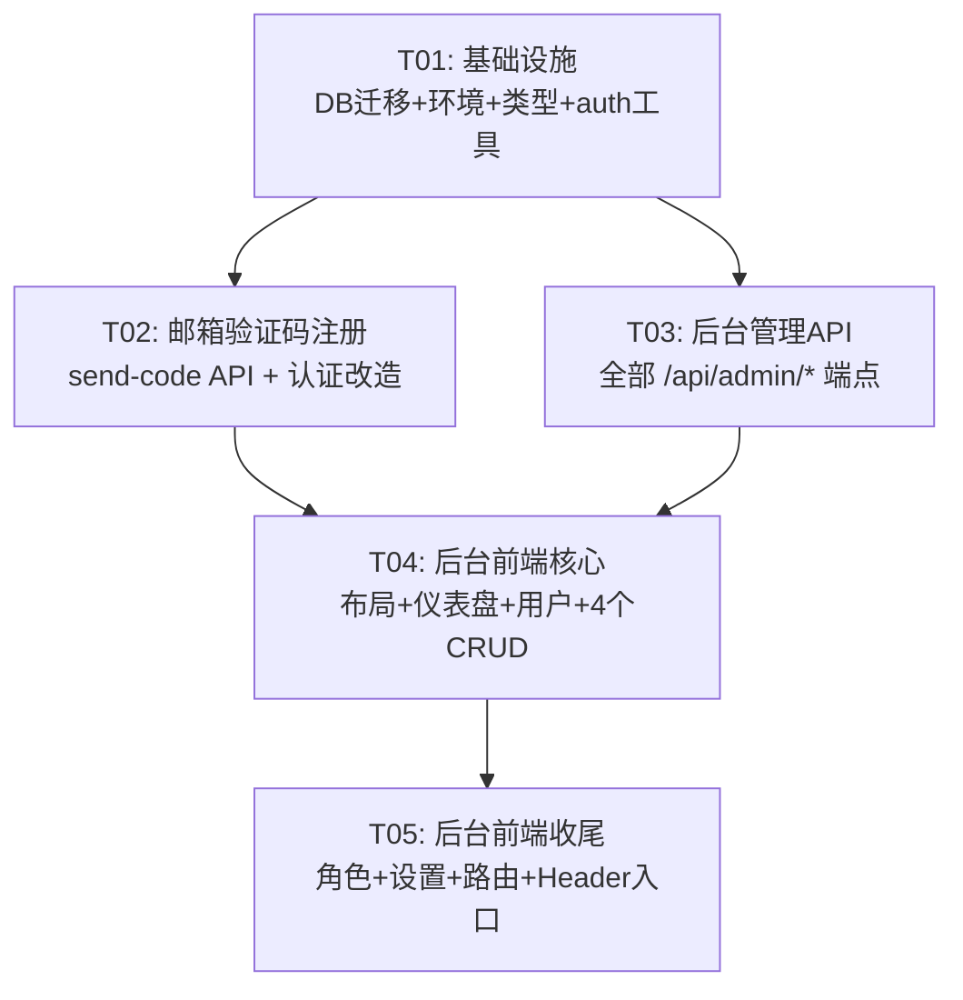

# cloudgame-hub V3.0 架构设计 — 任务分解 + 文件清单

> **基线**：V2.0 全栈（Vite+React+TS+Tailwind+CF Pages Functions+D1）
> **增量**：邮箱验证码注册 + 后台管理系统
> **日期**：2025-07-06 | **作者**：Bob（Architect）

---

## 1. 任务列表

### 任务1 [🔧修改] 基础设施层：DB 迁移 + 环境变量 + 类型定义 + 后端核心工具改造

**依赖**：无

**文件**：
```
schema.sql              🔧 — 新增 verification_codes 表 + users 表加 is_admin 字段 + email 唯一索引
.dev.vars               ✅ — 无需新增（Mailchannels 不需要 API Key）
wrangler.toml           🔧 — 新增 JWT_SECRET vars 声明（删除 RESEND_API_KEY）
functions/lib/auth.ts   🔧 — signJWT/verifyJWT 的 payload 加入 is_admin 字段
functions/lib/response.ts 🔧 — 新增 forbidden() 403 响应辅助函数
src/types/index.ts      🔧 — User 加 is_admin，新增 Admin 相关类型（分页参数、列表响应等）
```

**说明**：为后续两个模块提供统一基础。schema.sql 修正当前 users 表实际结构（已含 email/updated_at），新增 is_admin 和 verification_codes 表；auth.ts 扩展 JWT payload；types 补充管理员相关类型。

---

### 任务2 [🆕+🔧] 邮箱验证码注册：后端 send-code API + 改造认证 API + 前端认证页

**依赖**：任务1

**文件**：
```
functions/api/send-code.ts    🆕 — POST /api/send-code（生成6位验证码→存D1→Mailchannels发邮件，含60秒频率限制）
functions/api/register.ts     🔧 — 改为 email+code+password 注册，校验验证码有效性/过期/未使用
functions/api/login.ts        🔧 — 改为 email+password 登录，JWT payload 含 is_admin
functions/api/me.ts           🔧 — 返回 user 含 is_admin 字段
src/pages/AuthPage.tsx        🔧 — 注册 Tab 改为「邮箱→发验证码→输入验证码+密码+确认密码」流程
src/contexts/AuthContext.tsx   🔧 — register() 新增 code 参数；login() 改用 email；User 含 is_admin
```

**说明**：完成邮箱验证码注册闭环。使用 Mailchannels 免费邮件服务——Workers 通过 `fetch()` 调用 `https://api.mailchannels.net/tx/v1/send`，无需 API Key，无需注册第三方账号。验证码 5 分钟过期、60 秒频率限制、使用后标记 used=1。

---

### 任务3 [🆕+🔧] 后台管理后端 API：全部 /api/admin/* CRUD 端点 + 前端 API 客户端

**依赖**：任务1

**文件**：
```
functions/api/admin/users.ts               🆕 — GET /api/admin/users（邮箱搜索 + 分页，每页20条）
functions/api/admin/platforms.ts            🆕 — POST /api/admin/platforms（新增云游戏平台）
functions/api/admin/platforms/[id].ts       🆕 — PUT + DELETE /api/admin/platforms/:id
functions/api/admin/desktops.ts             🆕 — POST /api/admin/desktops（新增云电脑）
functions/api/admin/desktops/[id].ts        🆕 — PUT + DELETE /api/admin/desktops/:id
functions/api/admin/deals.ts                🆕 — POST /api/admin/deals（新增薅羊毛）
functions/api/admin/deals/[id].ts           🆕 — PUT + DELETE /api/admin/deals/:id
functions/api/admin/games.ts                🆕 — POST /api/admin/games（新增游戏）
functions/api/admin/games/[id].ts           🆕 — PUT + DELETE /api/admin/games/:id
src/services/api.ts                         🔧 — 新增 admin API 方法（getUsers, createPlatform, updatePlatform 等）
```

**说明**：所有 admin API 在 onRequest 中校验 `context.data.user.is_admin`，非管理员返回 403。用户列表支持 `?search=&page=&pageSize=` 查询参数。CRUD 接口返回统一的 `{code, data, message}` 信封。

---

### 任务4 [🆕] 后台管理前端核心：布局 + 路由守卫 + 仪表盘 + 用户管理 + 4 个内容 CRUD 页面

**依赖**：任务2、任务3

**文件**：
```
src/components/AdminRoute.tsx               🆕 — 管理员路由守卫（检查 authState.user.is_admin，否则重定向 /）
src/components/admin/AdminLayout.tsx        🆕 — 后台整体布局（左侧导航 + 顶部栏 + 右侧内容区 Outlet）
src/components/admin/Sidebar.tsx            🆕 — 左侧深色导航（可折叠，移动端抽屉式），9 个菜单项
src/components/admin/TopBar.tsx             🆕 — 顶部栏（管理员信息 + 返回前台 + 登出按钮 + 折叠按钮）
src/pages/admin/DashboardPage.tsx           🆕 — 仪表盘（4 统计卡片 + 近7日趋势图 mock + 最新用户 + 内容统计）
src/pages/admin/UsersPage.tsx               🆕 — 用户管理（邮箱搜索 + 分页表格，显示邮箱/注册时间/管理员标识）
src/pages/admin/content/PlatformsPage.tsx   🆕 — 云游戏平台 CRUD（表格 + 新增/编辑侧边抽屉 + 删除确认）
src/pages/admin/content/DesktopsPage.tsx    🆕 — 云电脑 CRUD（同上结构，适配云电脑字段）
src/pages/admin/content/DealsPage.tsx       🆕 — 薅羊毛 CRUD（分类筛选 + 有效期标记 + 表格 + 抽屉编辑）
src/pages/admin/content/GamesPage.tsx       🆕 — 游戏库 CRUD（类型筛选 + 表格 + 抽屉编辑）
```

**说明**：后台前端核心页面，全部使用 Tailwind CSS 原生样式（不引入 UI 库）。复用 `apiClient` 中任务3新增的 admin 方法。每个内容管理页结构统一：顶部搜索/筛选栏 + 表格 + 右下角 FAB 新增按钮 + 侧边抽屉编辑表单 + 删除确认对话框。

---

### 任务5 [🆕+🔧] 后台管理前端收尾：权限角色 + 系统设置 + App 路由集成 + Header 入口

**依赖**：任务4

**文件**：
```
src/pages/admin/RolesPage.tsx       🆕 — 权限角色管理（mock 数据：角色列表卡片 + 权限矩阵表格）
src/pages/admin/SettingsPage.tsx    🆕 — 系统设置（mock 数据：站点配置 + 邮件服务配置表单，保存按钮 mock）
src/App.tsx                         🔧 — 新增 /admin/* 路由树（AdminRoute 包裹 AdminLayout，内含 9 个子路由）
src/components/Header.tsx           🔧 — admin 用户头像旁显示「管理后台」链接，跳转 /admin/dashboard
```

**说明**：收尾集成。App.tsx 中 `/admin` 用 AdminRoute 守卫，嵌套 AdminLayout（Sidebar + TopBar + Outlet）。RolesPage 和 SettingsPage 均为纯前端 mock 页面。Header.tsx 仅在 `authState.user.is_admin` 时显示管理后台入口。

---

## 2. 完整文件清单汇总表

| 文件路径 | 状态 | 所属任务 |
|---------|------|---------|
| `schema.sql` | 🔧 修改 | T01 |
| `.dev.vars` | 🔧 修改 | T01 |
| `wrangler.toml` | 🔧 修改 | T01 |
| `functions/lib/auth.ts` | 🔧 修改 | T01 |
| `functions/lib/response.ts` | 🔧 修改 | T01 |
| `src/types/index.ts` | 🔧 修改 | T01 |
| `functions/api/send-code.ts` | 🆕 新增 | T02 |
| `functions/api/register.ts` | 🔧 修改 | T02 |
| `functions/api/login.ts` | 🔧 修改 | T02 |
| `functions/api/me.ts` | 🔧 修改 | T02 |
| `src/pages/AuthPage.tsx` | 🔧 修改 | T02 |
| `src/contexts/AuthContext.tsx` | 🔧 修改 | T02 |
| `functions/api/admin/users.ts` | 🆕 新增 | T03 |
| `functions/api/admin/platforms.ts` | 🆕 新增 | T03 |
| `functions/api/admin/platforms/[id].ts` | 🆕 新增 | T03 |
| `functions/api/admin/desktops.ts` | 🆕 新增 | T03 |
| `functions/api/admin/desktops/[id].ts` | 🆕 新增 | T03 |
| `functions/api/admin/deals.ts` | 🆕 新增 | T03 |
| `functions/api/admin/deals/[id].ts` | 🆕 新增 | T03 |
| `functions/api/admin/games.ts` | 🆕 新增 | T03 |
| `functions/api/admin/games/[id].ts` | 🆕 新增 | T03 |
| `src/services/api.ts` | 🔧 修改 | T03 |
| `src/components/AdminRoute.tsx` | 🆕 新增 | T04 |
| `src/components/admin/AdminLayout.tsx` | 🆕 新增 | T04 |
| `src/components/admin/Sidebar.tsx` | 🆕 新增 | T04 |
| `src/components/admin/TopBar.tsx` | 🆕 新增 | T04 |
| `src/pages/admin/DashboardPage.tsx` | 🆕 新增 | T04 |
| `src/pages/admin/UsersPage.tsx` | 🆕 新增 | T04 |
| `src/pages/admin/content/PlatformsPage.tsx` | 🆕 新增 | T04 |
| `src/pages/admin/content/DesktopsPage.tsx` | 🆕 新增 | T04 |
| `src/pages/admin/content/DealsPage.tsx` | 🆕 新增 | T04 |
| `src/pages/admin/content/GamesPage.tsx` | 🆕 新增 | T04 |
| `src/pages/admin/RolesPage.tsx` | 🆕 新增 | T05 |
| `src/pages/admin/SettingsPage.tsx` | 🆕 新增 | T05 |
| `src/App.tsx` | 🔧 修改 | T05 |
| `src/components/Header.tsx` | 🔧 修改 | T05 |

**与现有文件无关（无需修改）**：
`src/components/ProtectedRoute.tsx` ✅ — 前台路由守卫保持不变
`functions/_middleware.ts` ✅ — JWT 解析逻辑通用，无需改动
`functions/lib/db.ts` ✅ — 数据库工具函数无需改动
`src/hooks/useAuth.ts` ✅ — 薄封装无需改动
`src/services/api.ts` 🔧 — 仅新增 admin 方法，已有方法不变
`src/main.tsx`, `index.html`, `tailwind.config.js`, `postcss.config.js`, `tsconfig.json`, `vite.config.ts` ✅ 均不变

---

## 3. 新增依赖包

**无需新增 npm 依赖**。

- **Mailchannels 邮件服务**：在 Cloudflare Pages Functions 中直接用 `fetch()` 调用 `https://api.mailchannels.net/tx/v1/send`，零配置、零 API Key、完全免费。Workers 运行在 CF 全球边缘网络，不受国内网络限制。
- **后台 UI**：全部使用 Tailwind CSS 原生样式，不引入 Ant Design / MUI 等重型 UI 库（遵循 PRD 要求）。
- **图表**：仪表盘趋势图使用纯 SVG/CSS 实现 mock 展示，不引入 chart 库。
- **图标**：继续使用已有的 `lucide-react`（V2.0 已安装）。

---

## 4. 任务依赖图



> T02 和 T03 可并行开发（均仅依赖 T01），T04 需等 T02+T03 完成后进行，T05 最后收尾。

---

## 5. 关键技术决策

| 决策点 | 选择 | 理由 |
|--------|------|------|
| 邮件服务 | Mailchannels（REST API，零配置） | 完全免费、无需账号/API Key、CF Workers 原生兼容、全球边缘网络不受国内限制 |
| 验证码频率限制 | D1 查询实现（60s 窗口） | 简单可靠，无需引入 KV |
| JWT is_admin | 直接放入 JWT payload | 避免每次请求查库，性能最优 |
| 后台 UI 库 | 不使用，纯 Tailwind | PRD 要求轻量，保持 V2.0 风格 |
| admin API 路径 | 独立 `/api/admin/*` | 与前台只读 API 分离，middleware 统一校验 |
| 仪表盘图表 | 纯 SVG/CSS mock | 初期无真实统计需求，避免引入依赖 |
| schema.sql | 同步修正为实际 D1 结构 | 代码已用 email/updated_at，schema 文件需跟上 |
| 存量用户兼容 | email 用 `username@legacy.local` 占位 | 最小化迁移风险，登录同时支持 email 和 username |

---

## 6. 注意事项

1. **schema.sql 修正**：当前 `schema.sql` 与实际 D1 不同步（代码中 users 表已有 `email` 和 `updated_at`，但 schema 文件未声明）。T01 需先修正 schema.sql 再增量添加 `is_admin` 和 `verification_codes` 表。

2. **Mailchannels DNS 验证**：部署前需在 Cloudflare DNS 添加一条 TXT 记录以授权 Workers 发送邮件：
   ```
   类型: TXT
   名称: _mailchannels.hkdy123.top
   内容: v=mc1 cfid=cloudgame-hub.pages.dev
   ```
   无需任何 API Key，无需注册任何第三方账号。Workers 运行在 CF 全球边缘网络，不受国内墙限制。

2b. **JWT_SECRET 环境变量**：当前 `wrangler.toml` 未声明 `JWT_SECRET` vars，仅在 `.dev.vars` 中配置。生产环境需通过 `wrangler pages secret put JWT_SECRET` 设置。

3. **D1 迁移执行**：`schema.sql` 中的 `ALTER TABLE` 语句需在 D1 中手动执行（或通过 `wrangler d1 execute cloudgame-hub-db --file=schema.sql`）。

4. **管理员初始化**：部署后手动执行 `UPDATE users SET is_admin = 1 WHERE email = '你的邮箱';` 完成首个管理员提权。

5. **验证码清理**：P2 的定时清理（Cron Trigger）本期不做，`verification_codes` 表数据量小（个人站点），手动清理即可。
