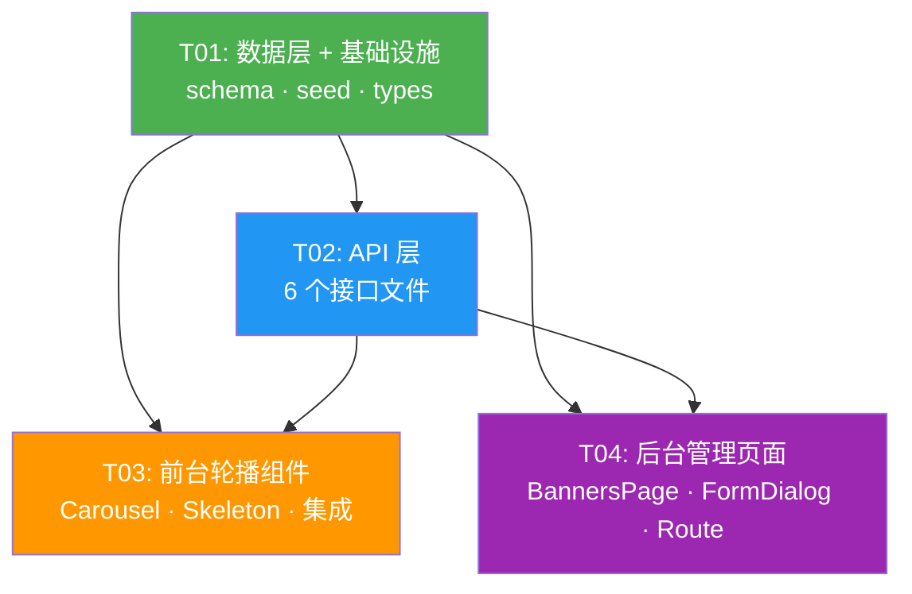

# System Design — Cloudgame Hub 轮播图 + 后台管理

> 版本：V6.0 ｜ 日期：2026-07-08 ｜ 作者：架构师 Bob ｜ 基于 PRD-轮播图

---

## Part A: 系统设计

### 1. 实现方案（Implementation Approach）

#### 1.1 核心技术挑战

1. **轮播图交互复杂度**：自动播放 4s、hover 暂停、移动端 swipe、箭头+圆点指示器、骨架屏加载态，需成熟的轮播库支撑
2. **图片上传安全**：Cloudflare Images API Token 不可暴露到前端，需后端代理上传
3. **代码一致性**：后台 CRUD 模式需与现有 announcements 模块保持高度一致，降低工程师学习成本
4. **时段过滤性能**：前台 API 需同时过滤 `is_active` + 时段条件，D1 SQL 要写准确
5. **排序原子性**：批量更新 sort_order 需在单次事务中完成

#### 1.2 框架与库选型

| 选型 | 方案 | 理由 |
|------|------|------|
| **轮播组件** | Swiper.js (`swiper@^11`) | 业界最成熟的 React 轮播库；原生支持 autoplay、navigation、pagination、loop、pauseOnMouseEnter、touch/swipe；社区活跃、文档完善、MUI/Tailwind 自定义样式容易 |
| **图片存储** | Cloudflare Images | PRD 已确认；自动裁剪/优化/CDN 分发，免运维 |
| **图片上传** | 后端代理 → CF Images API | 安全：API Token 仅存于 Worker 环境变量；前端发 multipart，后端转发 |
| **前台样式** | Tailwind CSS + MUI | 与项目现有技术栈一致 |
| **后台 UI** | MUI Table + Dialog | 与 AnnouncementsPage 模式一致 |
| **HTTP 客户端** | 原生 fetch | Cloudflare Workers/Pages Functions 环境仅有 fetch，无需额外库 |
| **状态管理** | React useState + useEffect | 轮播数据简单，无全局状态需求 |

#### 1.3 架构模式

- **前台**：组件化 — `BannerCarousel` 独立组件，注入首页顶部
- **后台**：页面级组件 — `BannersPage` + `BannerFormDialog`
- **API**：Cloudflare Pages Functions 文件路由 + `onRequest` 处理器，与 announcements 完全同构

---

### 2. 文件列表

#### 新增文件

| # | 相对路径 | 说明 |
|---|---------|------|
| 1 | `src/types/banner.ts` | Banner 类型定义（interface + API 响应类型） |
| 2 | `functions/api/banners.ts` | 前台公开 API：GET 当前生效轮播图 |
| 3 | `functions/admin/banners.ts` | 后台：列表（分页+搜索+筛选） + 创建 |
| 4 | `functions/admin/banners/[id].ts` | 后台：详情 + 编辑 + 删除 |
| 5 | `functions/admin/banners/[id]/toggle.ts` | 后台：快速切换启用/禁用 |
| 6 | `functions/admin/banners/sort.ts` | 后台：批量更新排序 |
| 7 | `functions/admin/banners/upload-image.ts` | 图片上传代理 → Cloudflare Images |
| 8 | `src/components/BannerCarousel.tsx` | 前台首页轮播组件（Swiper.js） |
| 9 | `src/components/BannerSkeleton.tsx` | 轮播图骨架屏加载占位组件 |
| 10 | `src/pages/Admin/BannersPage.tsx` | 后台轮播图管理列表页 |
| 11 | `src/components/Admin/BannerFormDialog.tsx` | 后台新建/编辑弹窗表单（含图片上传） |

#### 修改文件

| # | 相对路径 | 修改内容 |
|---|---------|------|
| 12 | `schema.sql` | 追加 `banners` 表 DDL |
| 13 | `seed.sql` | 追加 `banner:read` / `banner:write` 权限种子 |
| 14 | `src/types/index.ts` | 新增 `export * from './banner'` |
| 15 | `src/App.tsx` | 注册 `/admin/banners` 路由 → BannersPage |
| 16 | `src/pages/HomePage.tsx`（或首页组件） | 挂载 `<BannerCarousel />` 至顶部 |

---

### 3. 数据结构与接口

#### 3.1 TypeScript 类型定义

```typescript
// src/types/banner.ts

/** 轮播图数据模型（对应 D1 banners 表） */
export interface Banner {
  id: number;
  title: string;
  image_url: string;
  link_url: string;
  sort_order: number;
  is_active: number;          // 0 | 1
  start_time: string | null;  // ISO 8601 UTC
  end_time: string | null;    // ISO 8601 UTC
  description: string;
  created_at: string;         // ISO 8601 UTC
  updated_at: string;         // ISO 8601 UTC
}

/** 创建/编辑表单提交数据 */
export interface BannerFormData {
  title: string;
  image_url: string;
  link_url: string;
  sort_order: number;
  is_active: number;
  start_time: string | null;
  end_time: string | null;
  description: string;
}

/** 统一 API 响应包装 */
export interface ApiResponse<T> {
  code: number;
  data: T;
  message: string;
}

/** 前台 GET /api/banners 响应 data 字段 */
export interface BannersPublicResponse {
  banners: Banner[];
}

/** 后台 GET /admin/banners 响应 data 字段 */
export interface BannersListResponse {
  banners: Banner[];
  total: number;
  page: number;
  page_size: number;
}

/** 后台 PATCH /admin/banners/sort 请求 body */
export interface SortUpdateItem {
  id: number;
  sort_order: number;
}

/** 图片上传响应 data 字段 */
export interface ImageUploadResponse {
  image_url: string;
  image_id: string;
}
```

#### 3.2 API 接口定义

**前台公开 API**（无认证）：

| 方法 | 路径 | 说明 | 查询参数 | 响应 data |
|------|------|------|----------|-----------|
| GET | `/api/banners` | 获取当前生效轮播图 | 无 | `{ banners: Banner[] }` |

> 过滤逻辑：`is_active = 1 AND (start_time IS NULL OR start_time <= now) AND (end_time IS NULL OR end_time >= now)`，按 `sort_order ASC` 排序。

**后台管理 API**（需认证 + 权限）：

| 方法 | 路径 | 说明 | 请求 body / 查询参数 | 响应 data | 所需权限 |
|------|------|------|----------------------|-----------|----------|
| GET | `/admin/banners` | 分页列表 | `?page=1&page_size=10&search=&status=all|active|inactive` | `{ banners, total, page, page_size }` | banner:read |
| POST | `/admin/banners` | 创建 | BannerFormData | Banner | banner:write |
| GET | `/admin/banners/:id` | 详情 | — | Banner | banner:read |
| PUT | `/admin/banners/:id` | 编辑 | BannerFormData | Banner | banner:write |
| DELETE | `/admin/banners/:id` | 删除 | — | null | banner:write |
| PATCH | `/admin/banners/:id/toggle` | 切换启用/禁用 | — | Banner | banner:write |
| PATCH | `/admin/banners/sort` | 批量排序 | `{ items: SortUpdateItem[] }` | null | banner:write |
| POST | `/admin/banners/upload-image` | 上传图片 | multipart/form-data (field: `file`) | `{ image_url, image_id }` | banner:write |

#### 3.3 Mermaid 类图

见独立文件 `docs/class-diagram-banner.mermaid`

---

### 4. 程序调用流程

见独立文件 `docs/sequence-diagram-banner.mermaid`

包含三组时序图：
- 图 1：前台轮播加载流程（含骨架屏 + 空数据隐藏逻辑）
- 图 2：后台创建轮播图流程（含图片上传代理）
- 图 3：后台切换启用/禁用流程

---

### 5. 待明确事项

| # | 问题 | 假设/建议 |
|---|------|----------|
| 1 | 图片上传大小限制 | 前端限制 5MB；后端不做额外限制（Cloudflare Images 自有上限 10MB） |
| 2 | Cloudflare Images 环境变量 | 需在 `wrangler.toml` 配置 `CF_IMAGES_API_TOKEN` 和 `CF_IMAGES_ACCOUNT_HASH` |
| 3 | 首页组件文件名 | 假设为 `src/pages/HomePage.tsx`，工程师需确认实际路径 |
| 4 | 轮播图前台最大展示数量 | 建议 API 返回最多 10 条，避免过长 |
| 5 | 图片推荐尺寸 | 后台表单提示推荐 1920×600px（横版） |
| 6 | 删除时是否同步删除 CF Images 图片 | v1 不做同步删除，后续迭代 |
| 7 | 新权限 ID 起始值 | 需确认与现有 18 项权限 ID 不冲突（建议 id=19, 20） |
| 8 | Swiper CSS 样式引入方式 | `import 'swiper/css'` + `import 'swiper/css/navigation'` + `import 'swiper/css/pagination'`，或通过 Tailwind 完全覆盖默认样式 |

---

## Part B: 任务分解

### 6. 依赖包

```
- swiper@^11.1.0: 轮播图核心组件库（含 React 适配层 swiper/react）
```

> 注：项目已有 react@18、@mui/material、tailwindcss、lucide-react 等依赖，仅新增 swiper 一个包。

### 7. 任务列表（按依赖顺序）

---

#### T01: 数据层 + 基础设施

**源文件**：`schema.sql`, `seed.sql`, `src/types/banner.ts`, `src/types/index.ts`

**说明**：
- `schema.sql` 追加 `banners` 表 DDL（含所有字段、默认值、NOT NULL 约束）
- `seed.sql` 追加两条权限：`banner:read`(id=19)、`banner:write`(id=20)，并关联到 admin 角色
- 新建 `src/types/banner.ts`：定义 Banner、BannerFormData、ApiResponse、BannersPublicResponse、BannersListResponse、SortUpdateItem、ImageUploadResponse
- 修改 `src/types/index.ts`：追加 `export * from './banner'`
- 安装 `swiper` npm 包

**依赖**：无
**优先级**：P0

---

#### T02: API 层（前台 + 后台全部接口）

**源文件**：`functions/api/banners.ts`, `functions/admin/banners.ts`, `functions/admin/banners/[id].ts`, `functions/admin/banners/[id]/toggle.ts`, `functions/admin/banners/sort.ts`, `functions/admin/banners/upload-image.ts`

**说明**：
- 前台公开 API：`functions/api/banners.ts` — GET，is_active=1 + 时段过滤 + sort_order 排序
- 后台列表+创建：`functions/admin/banners.ts` — GET（分页、search、status 筛选）/ POST（创建）
- 后台详情+编辑+删除：`functions/admin/banners/[id].ts` — GET / PUT / DELETE
- 后台切换启用：`functions/admin/banners/[id]/toggle.ts` — PATCH，翻转 is_active (1→0, 0→1)
- 后台批量排序：`functions/admin/banners/sort.ts` — PATCH，接收 `{items: [{id, sort_order}]}`，单次事务批量 UPDATE
- 图片上传代理：`functions/admin/banners/upload-image.ts` — POST multipart → 调用 Cloudflare Images API (`https://api.cloudflare.com/client/v4/images/v1`) → 返回 CDN URL
- 所有后台接口复用现有 `getPermissions` / `checkPermission` 模式，banner:read 用于读操作，banner:write 用于写操作
- 列表 API 支持查询参数：`page`、`page_size`、`search`（标题模糊匹配）、`status`（all/active/inactive）

**依赖**：T01
**优先级**：P0

---

#### T03: 前台轮播组件 + 集成

**源文件**：`src/components/BannerCarousel.tsx`, `src/components/BannerSkeleton.tsx`, `src/pages/HomePage.tsx`（或首页组件）

**说明**：
- `BannerSkeleton`：骨架屏占位，匹配轮播区尺寸（全宽、高度匹配轮播图），Tailwind animate-pulse 动画
- `BannerCarousel`：
  - 使用 `Swiper` + `SwiperSlide`（swiper/react）
  - 配置：`autoplay={{ delay: 4000, pauseOnMouseEnter: true }}`、`navigation`、`pagination={{ clickable: true }}`、`loop={true}`
  - 状态：`loading` + `banners`，useEffect 初始化时 fetch `/api/banners`
  - loading 时渲染 `<BannerSkeleton />`，banners 为空数组时 return null（组件隐藏不占空间）
  - 每个 Slide：`<a href={banner.link_url}>` 包裹 ``，link_url 为空时仅展示图片不跳转
  - 移动端自适应：Swiper 自带 responsive + Tailwind 断点辅助，图片共用横版
- 集成：在首页组件顶部引入 `<BannerCarousel />`（参照 `AnnouncementBar` 的挂载位置）

**依赖**：T01, T02
**优先级**：P0

---

#### T04: 后台管理页面 + 路由注册

**源文件**：`src/pages/Admin/BannersPage.tsx`, `src/components/Admin/BannerFormDialog.tsx`, `src/App.tsx`

**说明**：
- `BannerFormDialog`：
  - MUI Dialog 表单，支持 create（空表单）和 edit（预填数据）两种模式
  - 字段：标题（TextField）、图片上传（Button + File Input + 预览 img）、链接（TextField）、排序值（TextField number）、启用开关（Switch）、展示时段（DateTimePicker start_time / end_time）、描述（TextField multiline）
  - 图片上传：选择文件 → 调用 `/admin/banners/upload-image`（multipart） → 获得 image_url → 显示预览
  - 表单校验：标题必填、image_url 必填、link_url 可选
  - 提交：POST `/admin/banners`（新建）或 PUT `/admin/banners/:id`（编辑）
- `BannersPage`：
  - MUI Table 展示列表：列包含 ID、标题、图片缩略图、链接、排序、状态(Switch)、时段、操作(编辑/删除)
  - 分页控件：MUI Pagination，与 API `page` / `page_size` 联动
  - 搜索框：标题关键词搜索
  - 状态筛选：Select 下拉（全部/启用/禁用）
  - 行内 Switch：切换启用/禁用 → PATCH `/admin/banners/:id/toggle`
  - 删除：确认 Dialog → DELETE `/admin/banners/:id`
  - 排序：手动输入 sort_order 或拖拽调整 → PATCH `/admin/banners/sort`
  - 新建按钮 → 打开 BannerFormDialog(mode=create)
  - 编辑按钮 → 打开 BannerFormDialog(mode=edit, banner=current)
- 修改 `src/App.tsx`：注册路由 `<Route path="/admin/banners" element={<BannersPage />} />`，包裹在 `ProtectedRoute` + `banner:read` 权限检查中

**依赖**：T01, T02
**优先级**：P0（列表/CRUD/切换 P0，排序拖拽 P1）

---

### 8. 共享知识

```
- API 响应格式：统一 {code: number, data: T, message: string}，code=0 表示成功
- 错误处理：API 异常返回 {code: 非0, data: null, message: 错误描述}
- 日期格式：所有日期字段使用 ISO 8601 UTC（如 2025-07-01T00:00:00Z）
- 权限名称：banner:read（读取）、banner:write（创建/编辑/删除/排序/切换/上传图片）
- 权限校验：复用现有 announcements 模块的 getPermissions / checkPermission 模式
- 环境变量：CF_IMAGES_API_TOKEN、CF_IMAGES_ACCOUNT_HASH（在 wrangler.toml 中配置）
- 图片 URL 格式：https://imagedelivery.net/<account_hash>/<image_id>/<variant>
- Swiper 引入：import { Swiper, SwiperSlide } from 'swiper/react'; import 所需 modules from 'swiper/modules'
- Swiper CSS：import 'swiper/css'; import 'swiper/css/navigation'; import 'swiper/css/pagination'
- 轮播组件隐藏：banners 为空数组时 return null，不占 DOM 空间
- CSS 断点：Tailwind 默认 sm(640) md(768) lg(1024) xl(1280)，轮播图主要关注 md+
- 排序值约定：sort_order 值越小排越前，新建默认值为当前最大值+10
- 前台 API 前缀：/api/
- 后台 API 前缀：/admin/
- 表名：banners（复数，与 announcements 一致）
- D1 datetime 函数：使用 datetime('now') 获取 UTC 时间，时段过滤用 start_time <= datetime('now')
```

### 9. 任务依赖图


